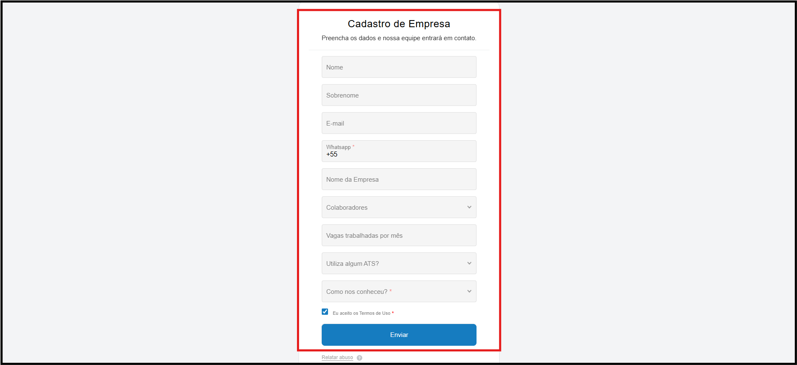

# <i data-lucide="users" class="icon-lg"></i> Cadastro na Plataforma

## <i data-lucide="target" class="icon-lg"></i> Objetivo

Ensinar como criar uma conta no sistema da **Rede Aviação** para acessar as funcionalidades de candidato, recrutador ou empresa (conforme permissões atribuídas).

---

## <i data-lucide="user-round-plus" class="icon-lg"></i> Cadastro Candidato

---

### <i data-lucide="square-check" class="icon-lg"></i> Pré-requisitos

- Acessar a tela de [Cadastro](https://www.redeaviacao.com.br/register)
- Ter acesso ao e-mail informado (para confirmação).

---

### <i data-lucide="notebook-pen" class="icon-lg"></i> Passo a passo

1. **Abrir a tela de registro**
      - Clique em **Acessar plataforma** no menu superior ou vá direto para a tela de [Cadastro](https://redeaviacao.com.br/register).
      

2. **Clicar em "Cadastre-se agora"**
      - Na tela de login, clique em **``Cadastre-se agora``** para iniciar o processo de registro.
      

3. **Preencher os campos obrigatórios**
      - Nome completo
      - CPF válido
      - Data de Nascimento
      - Telefone
      - E-mail válido
      - Senha (mínimo 8 caracteres)
      - Confirmação de senha
      - Ler e aceitar os **Termos de Uso** e **Política de Privacidade**.
      

4. **Enviar formulário**
      - Clique em **``Registrar``**.
      - Você será redirecionado para a tela de **verificação de e-mail**.
      
      
5. **Receber e-mail de verificação**
      - Verifique sua caixa de entrada (ou **Spam/Lixo eletrônico**).
      - O e-mail terá o assunto **"Verifique seu endereço de e-mail"**.
      
6. **Clicar no botão de confirmação**
      - Clique em **``Confirmar E-mail``**.
      - Você será redirecionado para o sistema.
      

7. **Entrar no sistema**
      - Após a confirmação do e-mail, acesse o sistema realizando o login normalmente.

---

## <i data-lucide="building-2" class="icon-lg"></i> Cadastro de Empresa

---

### <i data-lucide="square-check" class="icon-lg"></i> Pré-requisitos

- Acessar a tela de [Registro](https://www.redeaviacao.com.br/register)
- Ter acesso ao e-mail informado (para confirmação).

---

### <i data-lucide="notebook-pen" class="icon-lg"></i> Passo a passo

1. **Abrir a tela de cadastrar empresas**
      - Clique em **Cadastrar empresa** no menu superior ou vá direto para a tela de [Cadastro de Empresa](https://redeaviacao.com.br/company/pre-registration).
      
2. **Preencher os campos obrigatórios**  
      - Nome
      - Sobrenome
      - E-mail
      - WhatsApp
      - Nome da empresa
      - Quantidade de colaboradores
      - Número de vagas trabalhadas por mês
      - Utilização de ATS (Sim/Não)    
      - Como nos conheceu (Busca no Google, Instagram, Linkedin, Site da RedeAviação ou Outros)
      - Ler e aceitar os **Termos de Uso**
  
  3. **Enviar formulário**
      - Clique em **``Enviar``**.
      - Aguardar o contato da nossa equipe para validar as informações e criar a conta empresarial.

---

## <i data-lucide="wrench" class="icon-lg"></i> Solução de problemas

??? "**Já existe uma conta com este e-mail**"
      - Use a opção [Recuperar senha](https://www.redeaviacao.com.br/forgot-password) ou cadastre outro e-mail.

??? "**Não recebi o e-mail de confirmação**" 
      - Verifique **Spam/Lixo eletrônico**.  
      - Clique em **Reenviar e-mail de verificação** na tela do sistema.
      - Confirme se digitou o endereço de e-mail corretamente.
      
??? "**Link expirou**" 
      - Volte ao sistema e solicite um novo e-mail de verificação.

??? "CPF inválido ou já cadastrado"
      - Verifique se o número foi digitado corretamente.
      - Caso o CPF já esteja em uso, entre em contato com o suporte.

---

## <i data-lucide="lightbulb" class="icon-dica"></i> Dicas
- Se você for **convidado por uma empresa**, use o mesmo e-mail do convite.
- Para alternar entre funções (ex.: candidato e recrutador), o administrador pode atribuir permissões à mesma conta.
- Não é necessário criar contas diferentes para cada função.
- Se utilizou o e-mail corporativo, verifique com seu provedor se mensagens externas não estão bloqueadas.
- Para maior segurança, **não compartilhe sua conta ou senha** com terceiros.