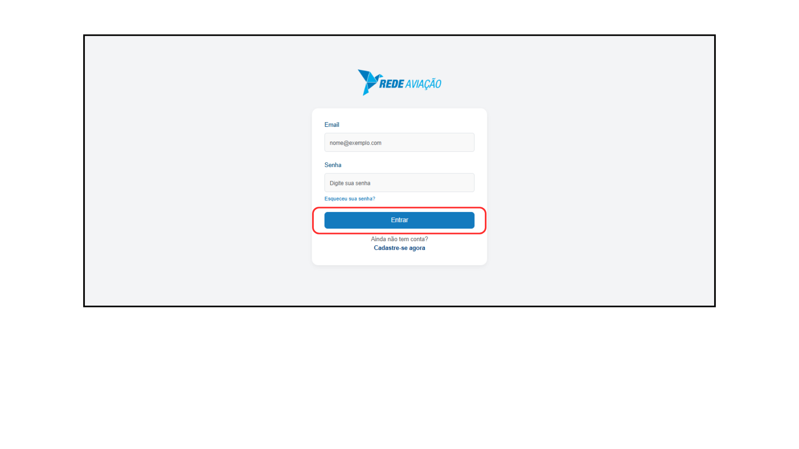

# <i data-lucide="key-round" class="icon-lg"></i> Login no Sistema

### <i data-lucide="target" class="icon-lg"></i> Objetivo

Ensinar como acessar o sistema da Rede Aviação.

---

### <i data-lucide="square-check" class="icon-lg"></i> Pré-requisitos

- Ter uma **conta criada** no sistema (via cadastro ou convite de empresa).
- Ter confirmado o e-mail (caso exigido).
- Acesse a tela de [Login](https://redeaviacao.com.br/login).

---

### <i data-lucide="notebook-pen" class="icon-lg"></i> Passo a passo

1. **Abrir a tela de login**

    - Clique em **`Entrar`** no menu superior ou vá direto para [Login](https://redeaviacao.com.br/login).
    

2. **Preencher credenciais**

    - Informe o **e-mail** cadastrado.
    - Digite a **senha** escolhida no cadastro.
    

3. **Clicar em `Entrar`**

    - Você será redirecionado para o **dashboard inicial** do sistema.

---

### <i data-lucide="wrench" class="icon-lg"></i> Solução de problemas

??? "**Erro de credenciais inválidas**"
    - Confirme se digitou o e-mail corretamente.
    - Senha diferencia maiúsculas/minúsculas.
    - Se esqueceu, use [Esqueceu a senha](https://redeaviacao.com.br/forgot-password).

??? "**Não recebi o e-mail de confirmação**"
    - Verifique a pasta **Spam/Lixo eletrônico**.
    - Solicite novo link clicando em **Reenviar e-mail de verificação**.

??? "**Conta bloqueada**"
    - O sistema pode bloquear tentativas excessivas de login.
    - Aguarde alguns minutos ou entre em contato com o suporte.

---

### <i data-lucide="lightbulb" class="icon-dica"></i> Dicas

- Caso esteja vinculado a mais de uma empresa, escolha a **empresa ativa** no topo após logar.

