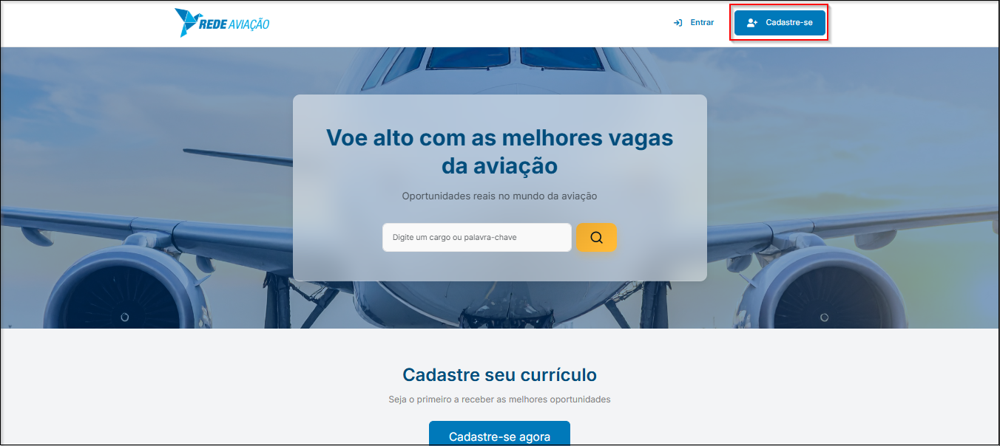
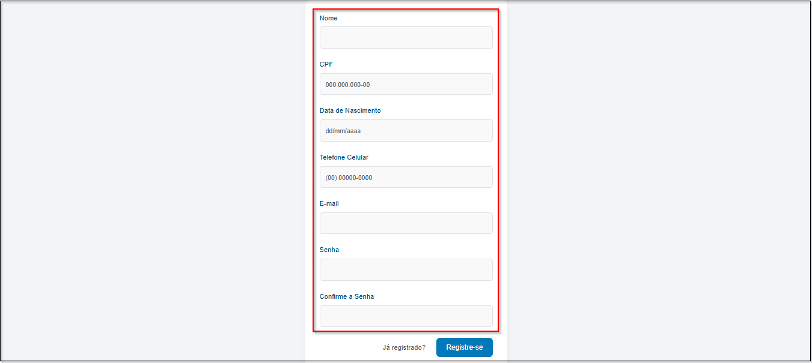
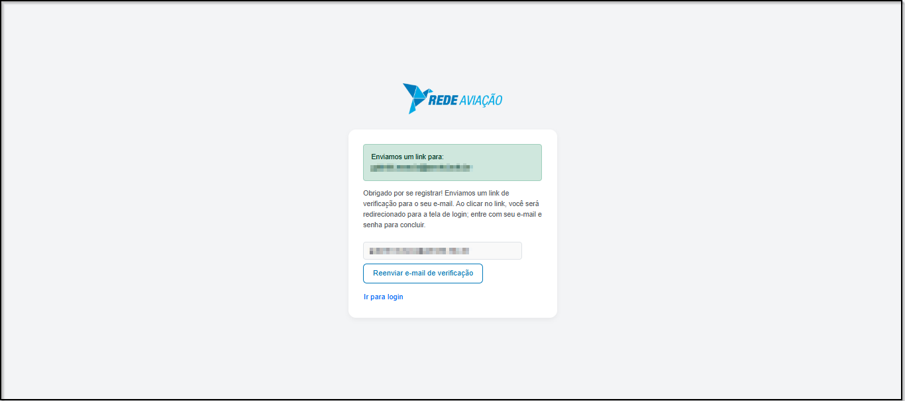
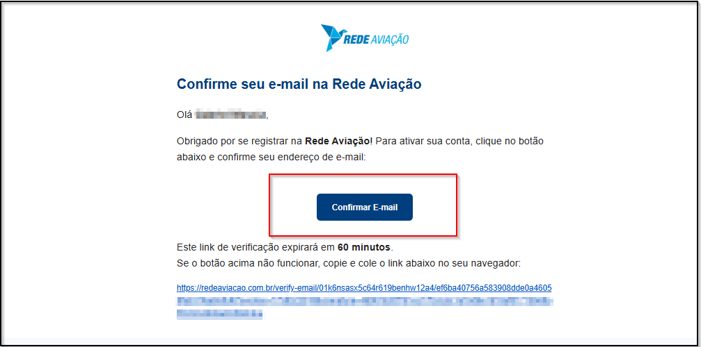

# <i data-lucide="user-round-plus" class="icon-lg"></i> Registro de Usuário

### <i data-lucide="target" class="icon-lg"></i> Objetivo

Ensinar como criar uma conta no sistema da **Rede Aviação** para acessar as funcionalidades de candidato, recrutador ou empresa (conforme permissões atribuídas).

---

### <i data-lucide="square-check" class="icon-lg"></i> Pré-requisitos

- Acessar a tela de [Registro](https://www.redeaviacao.com.br/register)
- Ter acesso ao e-mail informado (para confirmação).

---

### <i data-lucide="notebook-pen" class="icon-lg"></i> Passo a passo

1. **Abrir a tela de registro**
      - Clique em **Registrar** no menu superior ou vá direto para tela de [Registro](https://redeaviacao.com.br/register).
      

2. **Preencher os campos obrigatórios**
      - Nome completo
      - CPF válido
      - Data de Nascimento
      - Telefone
      - E-mail válido
      - Senha (mínimo 8 caracteres)
      - Confirmação de senha
      

3. **Enviar formulário**
      - Clique em **``Registrar``**.
      - Você será redirecionado para a tela de **verificação de e-mail**.
      
      
4. **Receber e-mail de verificação**
      - Verifique sua caixa de entrada (ou Spam).
      - O e-mail terá o assunto **"Verifique seu endereço de e-mail"**.
      
5. **Clicar no botão de confirmação**
      - Clique em **Confirmar e-mail**.
      - Você será redirecionado para o sistema.
      

6. **Entrar no sistema**
      - Após a confirmação, faça login normalmente.

---

### <i data-lucide="wrench" class="icon-lg"></i> Solução de problemas

??? "**Já existe uma conta com este e-mail**"
      - Use a opção [Recuperar senha](https://www.redeaviacao.com.br/forgot-password) ou cadastre outro e-mail.

??? "**Não recebi o e-mail de confirmação**" 
      - Verifique **Spam/Lixo eletrônico**.  
      - Clique em **Reenviar e-mail de verificação** na tela do sistema.
      
??? "**Link expirou**" 
      - Volte ao sistema e solicite um novo e-mail de verificação.

---

### <i data-lucide="lightbulb" class="icon-dica"></i> Dicas
- Se você for **convidado por uma empresa**, use o mesmo e-mail do convite.
- Para alternar entre funções (ex.: candidato e recrutador), o administrador pode atribuir permissões à mesma conta.
- Não é necessário criar contas diferentes para cada função.
- Se utilizou o e-mail corporativo, verifique com seu provedor se mensagens externas não estão bloqueadas.