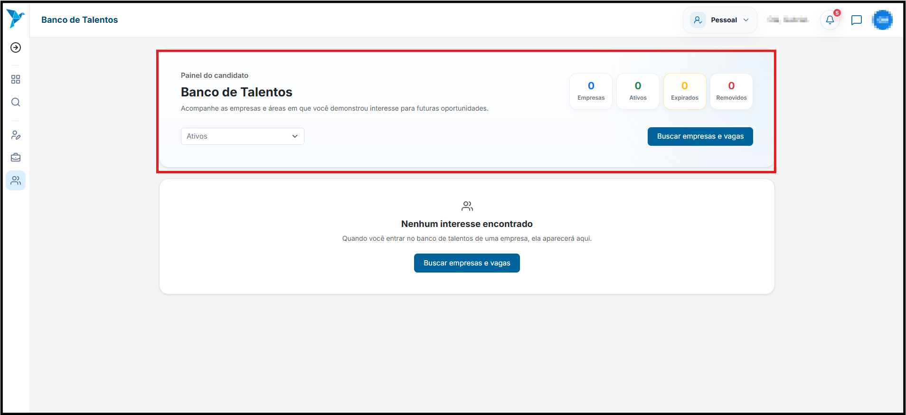
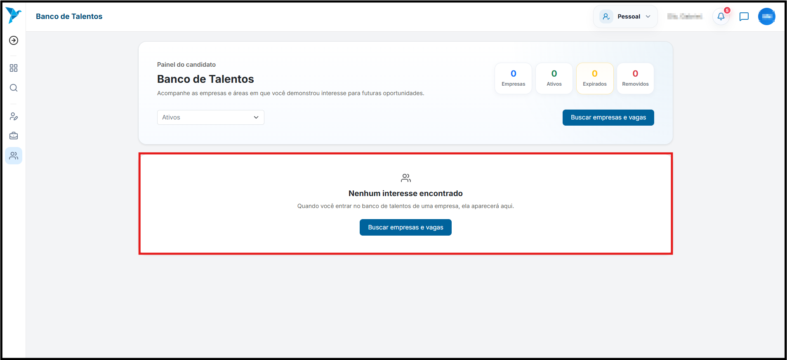

# <i data-lucide="database" class="icon-lg"></i> Banco de Talentos

### <i data-lucide="target" class="icon-lg"></i> Objetivo

Se inscrever em **Banco de Talentos** para localizar vagas cadastradas na plataforma, e aumentar a chance de ser selecionado.

---

### <i data-lucide="square-check" class="icon-lg"></i> Pré-requisitos

- Ter uma **conta criada** no sistema.
- Estar logado com um **perfil pessoa**.
- Possuir permissão para acessar o Banco de Talentos.
- Acessar o menu lateral e clicar em **`Banco de Talentos`** ou acessar a página em [Banco de Talentos](https://redeaviacao.com.br/dashboard/usuario/banco-de-talentos)

---

## <i data-lucide="users" class="icon-lg"></i> Banco de Talentos

---

### <i data-lucide="notebook-pen" class="icon-lg"></i> Passo a passo

1. **Acesse o menu `Banco de Talentos`.**

2. **A tela exibirá um pequeno dashboard de `Empresas Cadastradas`, `Cargos Ativos`, `Cargos Expirados` e `Cargos Removidos` no Banco de Talentos.**

3. **Para buscar empresas e vagas, basta clicar no botão `Buscar empresas e vagas`**
   

---

### <i data-lucide="wrench" class="icon-lg"></i> Solução de problemas

??? "**Não consigo acessar o Banco de Talentos**"
    - Verifique se você está logado com uma conta do tipo **Pessoa**.
    - Atualize a página (CTRL + F5) e tente novamente.
    - Faça login novamente no sistema.
    - Caso o problema persista, entre em contato com o suporte.

??? "**Não encontrei empresas ou vagas**"
    - Verifique se existem empresas com Banco de Talentos disponível na plataforma.
    - Tente realizar uma nova busca após alguns instantes.
    - Novas empresas e vagas podem ser adicionadas a qualquer momento.

??? "**Erro ao carregar a página**"
    - Verifique sua conexão com a internet.
    - Atualize a página.
    - Caso o problema persista, tente acessar utilizando outro navegador ou entre em contato com o suporte.

---

### <i data-lucide="lightbulb" class="icon-dica"></i> Dicas

- Mantenha seu **currículo e dados cadastrais sempre atualizados**, aumentando suas chances de ser encontrado pelas empresas.
- Cadastre informações completas sobre sua formação, experiências e qualificações.
- Consulte o Banco de Talentos regularmente, pois novas empresas e oportunidades podem ser adicionadas.
- Verifique seu e-mail e acompanhe as notificações da plataforma para não perder oportunidades.
- Antes de se candidatar a uma vaga, revise seus dados para garantir que as informações estejam corretas.