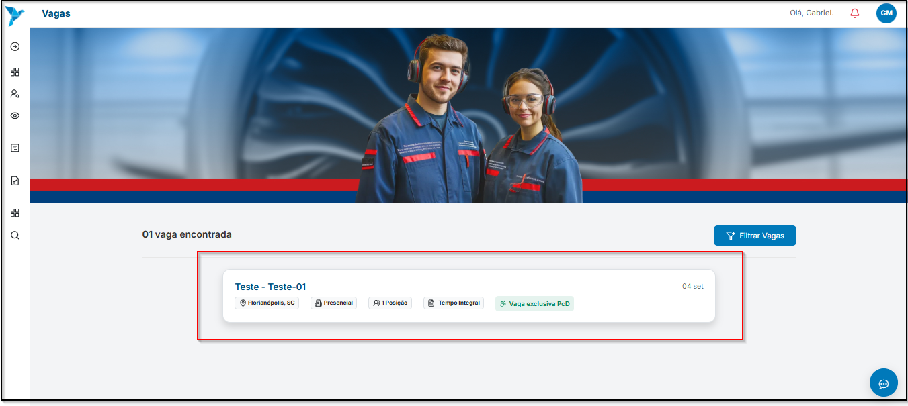
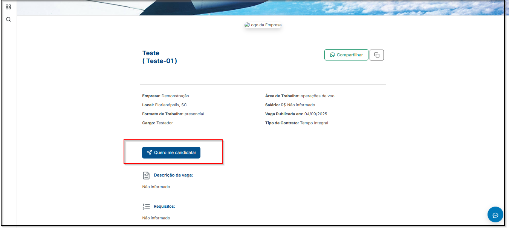
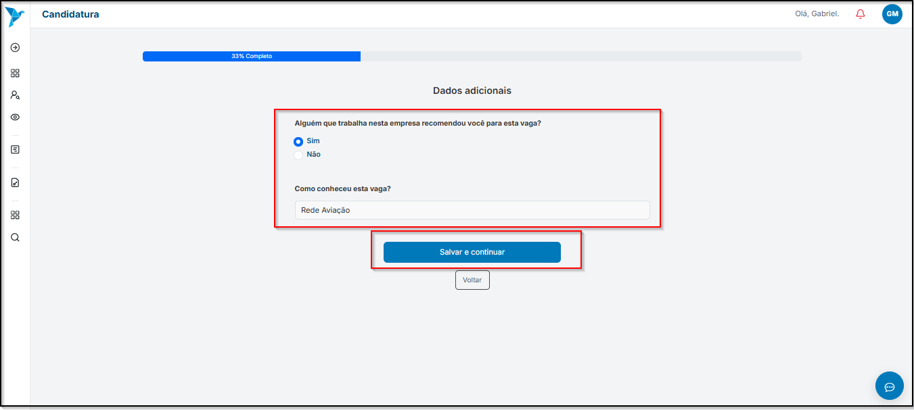
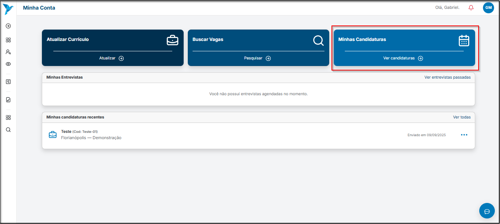
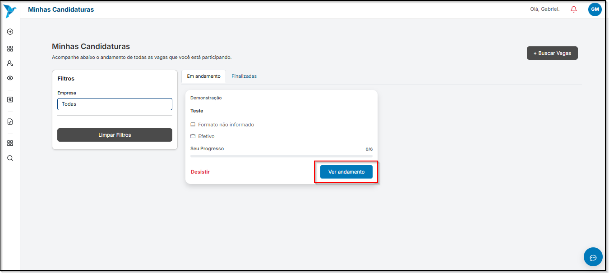
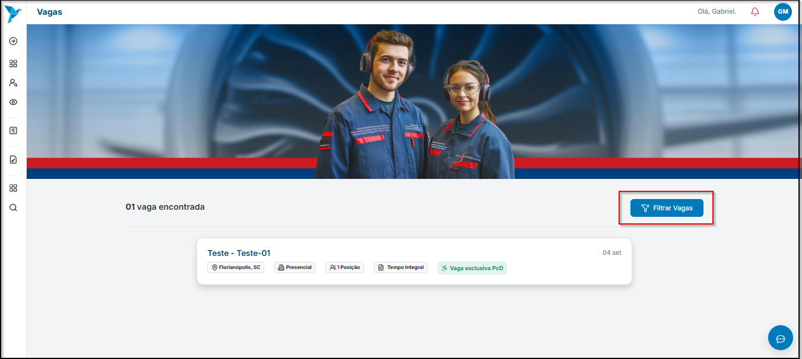

# <i data-lucide="check" class="icon-lg"></i> Candidatar a vagas

---

## <i data-lucide="target" class="icon-lg"></i> Objetivo

Ensinar como se candidatar em uma vaga.

---

## <i data-lucide="square-check" class="icon-lg"></i> Pré-requisitos

- Ter uma **conta criada** no sistema (via cadastro ou convite de empresa).
- Estar logado com um perfil de candidato.
- Acesse a página de [Vagas Abertas](https://www.redeaviacao.com.br/home/vagas)

---

## <i data-lucide="notebook-pen" class="icon-lg"></i> Passo a passo

1. Abrir a tela [Meu Dashboard](https://redeaviacao.com.br/dashboard/usu%C3%A1rio)

2. **Candidatar a uma vaga em específico**
    - Selecionar a vaga.
    
    - Clicar na opção **`Quero me candidatar`**.
    
    - Caso tenha sido indicado por alguém que trabalha na empresa na qual está se candidatando, selecione a opção e informe o nome completo do colaborador e setor (caso seja solicitado). 
    

3. **Acompanhar Candidatura**
    - Clique em **`Meu dashboard`** no menu suspenso à esquerda.
    - Selecionar a caixa [Minhas candidaturas](https://redeaviacao.com.br/dashboard/usu%C3%A1rio/minhas-candidaturas)
    
    - Selecione a vaga que deseja verficar o seu progresso e clique em **`Ver andamento`** para ter mais detalhes
    
    - Caso deseje filtrar as vagas disponíveis, clique em **`Filtrar Vagas`** no botão à direita.
    
    - Caso tenha criado um filtro e queira remover o filtro para voltar ao padrão, clique no botão **`Limpar filtros aplicados`** no botão à esquerda do **`Filtrar vagas`** 
    

---

## <i data-lucide="wrench" class="icon-lg"></i> Solução de problemas

??? "**Acompanhar Candidatura**"
    - Verifique se está logado como candidato, não como recrutador.
    - Confirme se preencheu todos os campos obrigatórios da candidatura.
    - Se a vaga já expirou, ela não estará disponível para candidatura.
