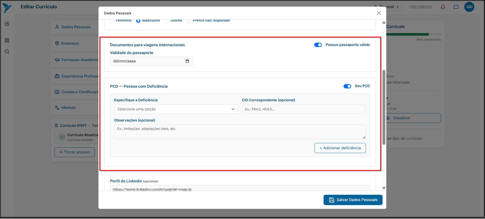
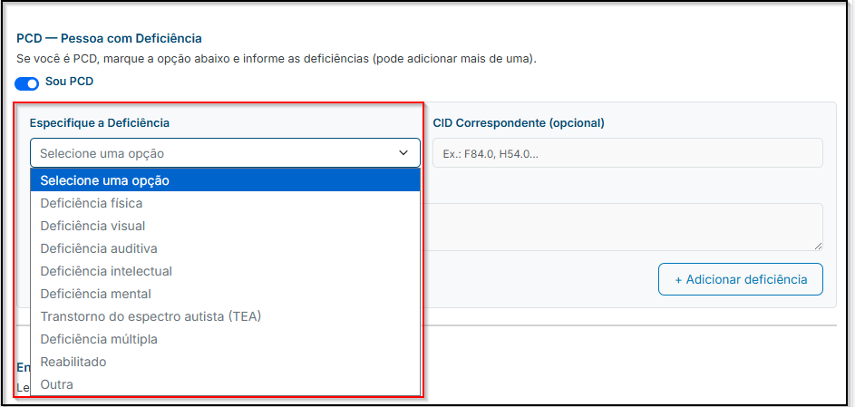
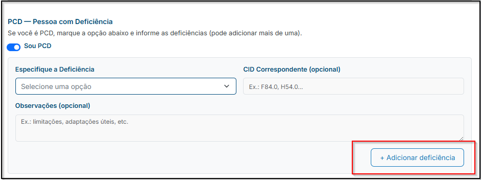
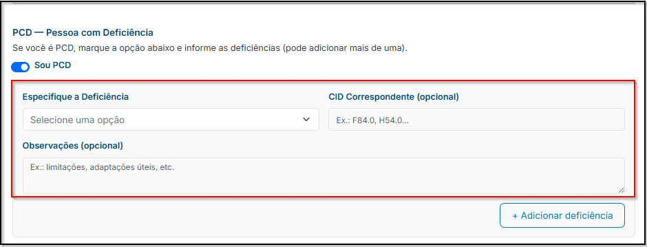
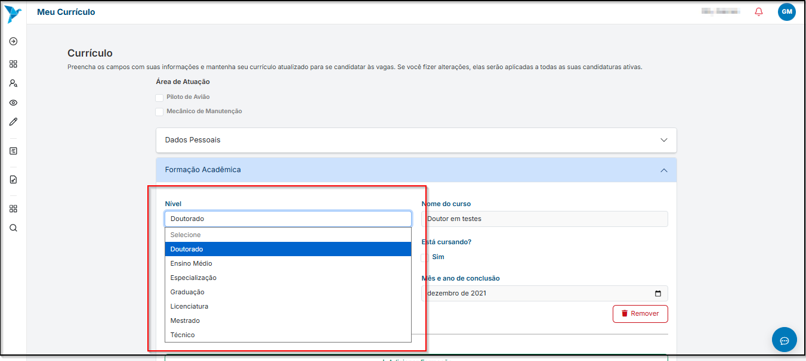
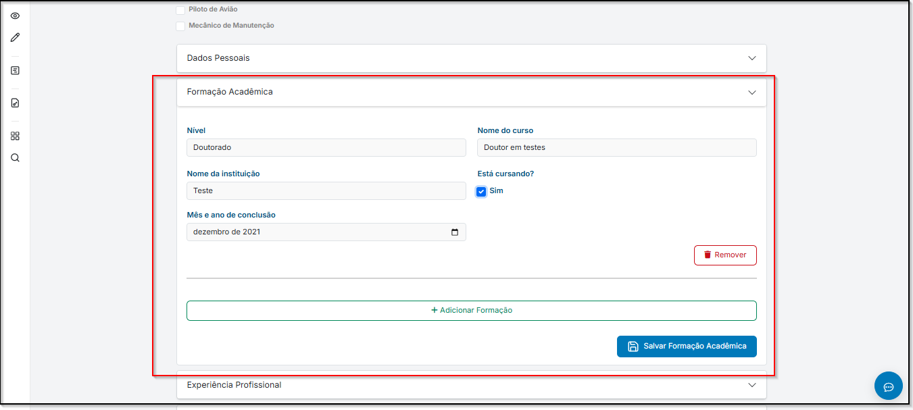
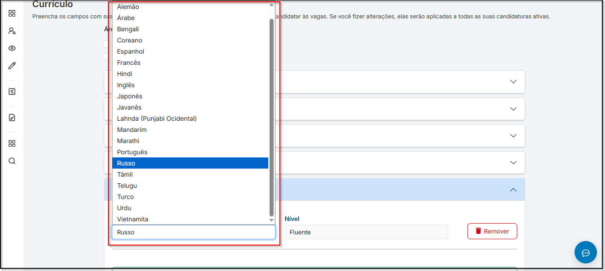
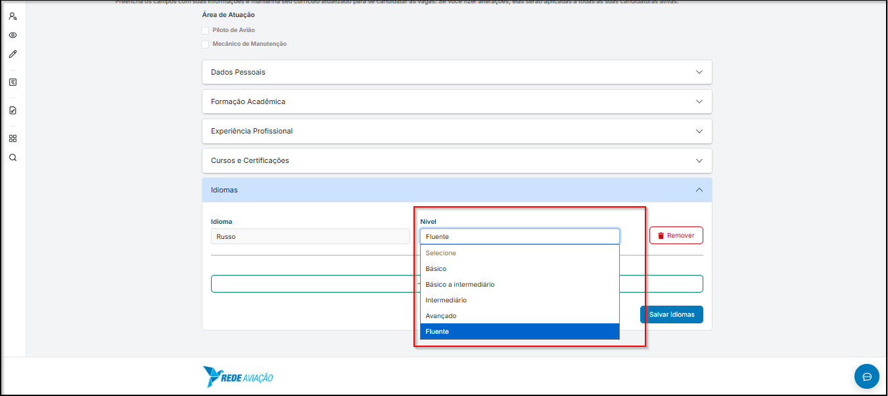
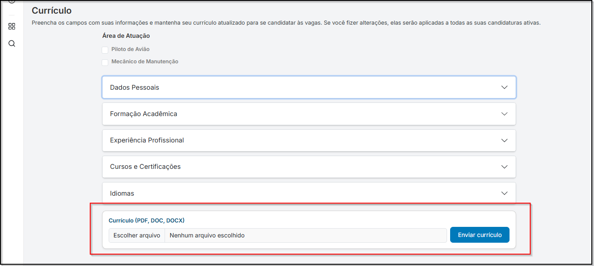

# <i data-lucide="check" class="icon-lg"></i> Cadastro de currículo

### <i data-lucide="target" class="icon-lg"></i> Objetivo

Cadastrar currículo para poder se candidatar às vagas.

---

### <i data-lucide="square-check" class="icon-lg"></i> Pré-requisitos

- Ter uma **conta criada** no sistema (via cadastro ou convite de empresa).
- Estar logado com um **perfil de candidato**.
- Acesse a página [Currículo](https://redeaviacao.com.br/dashboard/curr%C3%ADculo)

---

### <i data-lucide="notebook-pen" class="icon-lg"></i> Passo a passo

1. **Abrir o perfil**
    - Clicar no **``Perfil``** no canto superior a direita.

2. **Acessar o currículo**
    - Clicar em **``Meu currículo``**.

3. **Preencha os campos solicitados** 

    - **Dados Pessoais** 
        - Insira todas as suas informações pessoais atualizadas para facilitar na busca de vagas.
        - Mantenha sempre as informações atualizadas para as buscas serem mais adequadas ao seu perfil.
            - **Primeiro Nome:** informe o seu primeiro nome para ser cadastro.
            - **Sobrenome:** informe o seu sobrenome para ser cadastro.
            - **Nome Social:** informe o nome no qual prefere ser chamado.
            - **Data de nascimento:** informe a sua data de nascimento para o cadastro.
            - **Telefone de contato:** informe o seu telefone para contato.
            - **Código CANAC** informe o seu código CANAC (ex.: 1234567 ou ANAC12345).
            - **Gênero:** informe o seu gênero para cadastro, caso não queria informar clique em **``Prefiro não responder``**.
            
            - **Documentos para viagens internacionais** (informe a validade do passaporte)
            - **PCD** (informe a sua deficiência caso você possua algum tipo de deficiência)
            
                - **`Especifique a deficiência`**: selecione o tipo de deficiência.
                
                - **`CID Correspondente`**: campo **opicional**, insira o código CID relacionado à deficiência. (ex.: F84.0, H54.0...).
                - **`Observações`**: descreva quais são as suas limitações, se há adaptações úteis ou outras informações relevantes.
                - Para adicionar mais de uma deficiência, clique em **`+ Adicionar Deficiência`**.
                
            - 
            - **Perfil do Linkedin** (informe o link do seu perfil do Linkedin, caso tenha um perfil e queira informar).
            - **Informações profissionais** (informe a função que você exerce atualmente e função pretendida na aviaçao).
            - **Disponibilidade** (Disponível para viagens e mudança)
             
    
    - **Endereço**
        - Informe o seu endereço completo para facilitar a busca por vagas próximas a você.
        - Mantenha os dados sempre atualizados para aumentar a relevância do seu perfil.
            - **CEP:** informe o CEP do seu endereço para facilitar o preenchimento dos outros campos (somente números).
            - **Endereço**:** informe o nome da rua onde você mora.
            - **Complemento:** informe um complemento caso seja necessário (ex.: apartamento, bloco, etc.).
            - **Bairro:** informe o nome do bairro onde você mora.
            - **Cidade:** informe o nome da cidade onde você mora.
            - **UF:** informe o estado onde você mora.
             

    - **Formação Acadêmica**
        - Mantenha os dados sempre atualizados para aumentar a relevância do seu perfil.
        
             - **Nível:** informe qual o nível da sua formação acadêmica.
            
            - **Nome do curso:** informe o nome da sua formação acadêmica
            - **Nome da instituição:** informe qual é o nome da instituição que você realizou ou está realizando a formação.
            - Caso esteja cursando o curso, marque a opção **`Sim`** e informe o mês e ano de conclusão
            
            - Para adicionar mais formações, clique em **`+ Adicionar Formação`** e preencha as informações.
            - Após preencher todos os campos, clique em **`Salvar Formação Acadêmica`** para salvar as informações.
    
    - **Experiências profissionais**
        - Informe todas ou, pelo menos, as suas últimas experiências. _Essas informações podem ser decisivas no processo seletivo._
        - É importante informar a última empresa que trabalhou juntou ao **cargo**, caso esteja trabalhando atualmente nesta empresa selecione a opção **`Sim`** e informe qual foi a sua **Data de ínicio** no cargo.
        - Descreva as suas principais atividades realizadas no cargo.
        - **Caso deseje informar mais de uma experiência profissional, clique em `+ Adicionar Experiência` e preencha as informações.**
        - **Após preencher todos os campos, clicar em `Salvar Experiências Profissionais` para salvar as informações.**
        
           
    - **Cursos e Certificações**
        - Dê preferência em colocar os cursos/certificações relevantes da área desejada.
        - Para adicionar mais de um curso, basta clicar em **`+ Adicionar outro curso`**
        - **Após preencher todos os campos, clicar em `Salvar Cursos e Certificações`.**
        

    - **Idiomas**
        - Informe o(s) idioma(s) que você fala sempre colocando o nível de domínio. _Algumas entrevistas poderão acontecer com base no seu nível de domínio._
            - **Idioma** (informe o que você tem conhecimento)
            
            - **Nível** (informe qual é o nível de domínio)
            
        - **Caso queira adicionar mais de um idioma, clique em `+ Adicionar mais idiomas` e preencha as informações.**
        - **Após preencher todos os campos, clicar em `Salvar Idiomas` para salvar as informações.** 
            
    
    - **Anexar Currículo**
        - Caso deseje anexar o seu currículo, basta clicar em **`Escolher arquivo`**, selecionar o arquivo e **`Enviar o currículo`**.
        - Será aceito apenas arquivos que possuam os formatos **PDF, DOC, DOCX**. 
        - O arquivo deve o tamanho **máximo de 5MB**
        - Após o envio, o currículo ficará disponível no sistema para visualização pelas empresas.    
        -   

---

### <i data-lucide="wrench" class="icon-lg"></i> Solução de problemas

??? "**Não consigo acessar a página de currículo**"
    - Verifique se está logado como candidato **(não funciona para perfil de recrutador)**.

??? "**Erro ao salvar currículo**"
    - Confirme se todos os campos obrigatórios (*) foram preenchidos.
    - Se estiver anexando arquivos, verifique se o formato e o tamanho são permitidos (ex.: PDF até 5MB).

??? "**Currículo não aparece atualizado**"
    - Tente atualizar a página (CTRL + F5).
    - Saia e entre novamente no sistema.

??? "**Esqueci de preencher informações importantes**"
    - Clique em Editar currículo dentro do seu perfil.
    - Altere os dados necessários e clique em **``Salvar``** novamente.

??? "Problemas com upload de arquivos"
    - Certifique-se de que o arquivo não está corrompido.
    - Tente outro navegador ou aba anônima se o problema persistir.

### <i data-lucide="lightbulb" class="icon-dica"></i> Dicas

- Mantenha seu currículo sempre atualizado para aumentar as chances de contratação.
- Destaque **habilidades-chave** e certificações relevantes.
- Evite deixar campos em branco, quanto mais completo, melhor.
- Use **linguagem clara e objetiva** ao descrever experiências profissionais.
- Atualize suas informações de contato sempre que necessário.
- Revise o currículo periodicamente (mensal ou trimestral) para garantir precisão.
