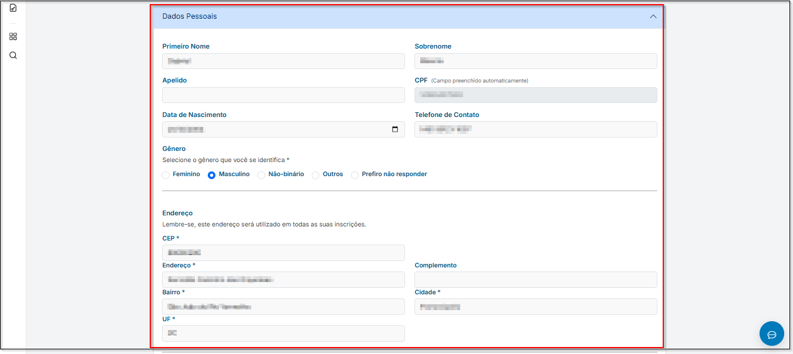
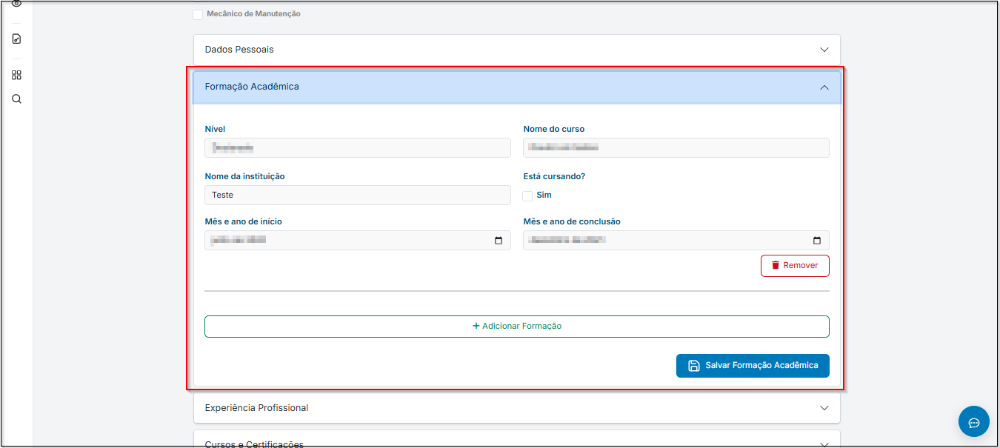
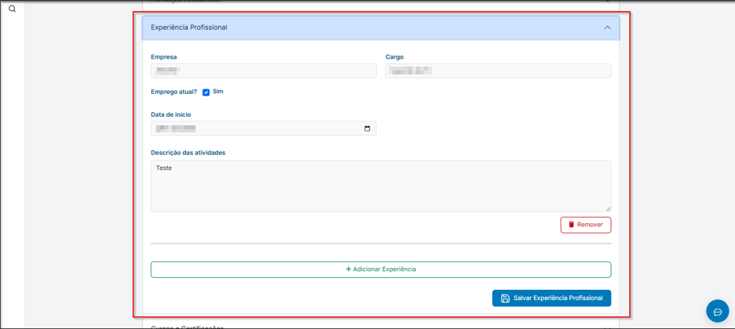
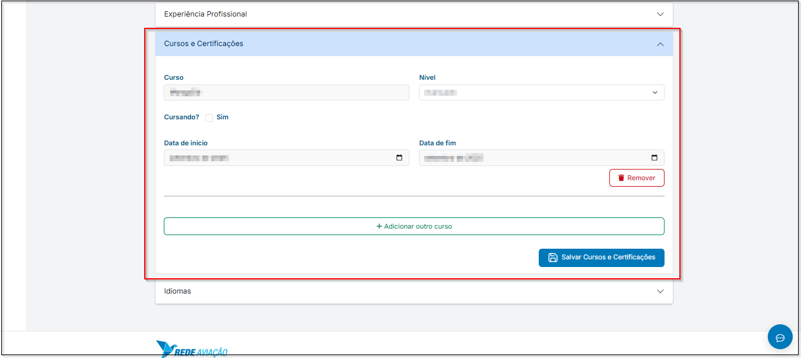
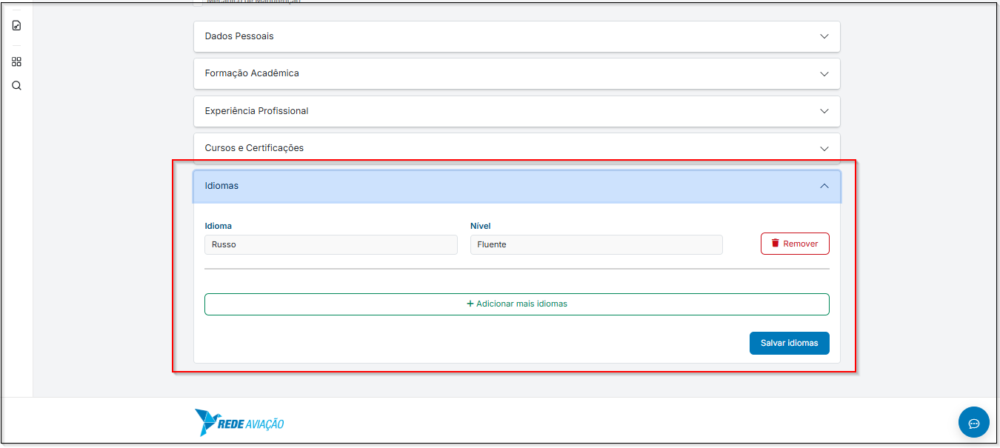

# <i data-lucide="check" class="icon-lg"></i> Cadastro de currículo

## <i data-lucide="target" class="icon-lg"></i> Objetivo

Cadastrar currículo para poder se candidatar às vagas.

---

## <i data-lucide="square-check" class="icon-lg"></i> Pré-requisitos

- Ter uma **conta criada** no sistema (via cadastro ou convite de empresa).
- Estar logado com um perfil de candidato.
- Acesse a página [Currículo](https://redeaviacao.com.br/dashboard/curr%C3%ADculo)

---

## <i data-lucide="notebook-pen" class="icon-lg"></i> Passo a passo

1. Clicar no **``Perfil``** localizado no canto superior a direita.

2. Clicar em **``Meu currículo``**.

3. Preencha os campos solicitados 

    - ??? "**Dados Pessoais**" 
        - Insira todas as suas informações pessoais atualizadas para facilitar na busca de vagas.
        
    
    - ??? "**Formação Acadêmica**"
        - Mantenha as informações sempre atualizadas para aumentar a relevância do seu perfil.
        
    
    - ??? "**Experiências profissionais**"
        - Informe todas as suas experiências na área, ou pelo menos, as últimas experiências. _Essas informações podem ser decisivas no processo seletivo._
        

    - ??? "**Cursos e Ceritifcações**"
        - Dê preferência em colocar os cursos relevantes da área desejada.
        

    - ??? "**Idiomas**"
        - Informe o(s) idioma(s) que você fala sempre colocando o nível de domínio. _Algumas entrevistas poderão acontecer com base no seu nível de domínio._
             

4. Clique em **``Salvar``** para finalizar o cadastro

---

## <i data-lucide="wrench" class="icon-lg"></i> Solução de problemas

#### Não consigo acessar a página de currículo

- Verifique se está logado como candidato **(não funciona para perfil de recrutador)**.

#### Erro ao salvar currículo

- Confirme se todos os campos obrigatórios (*) foram preenchidos.

- Se estiver anexando arquivos, verifique se o formato e o tamanho são permitidos (ex.: PDF até 5MB).

#### Currículo não aparece atualizado

- Tente atualizar a página (CTRL + F5).
- Saia e entre novamente no sistema.

#### Esqueci de preencher informações importantes

- Clique em Editar currículo dentro do seu perfil.
- Altere os dados necessários e clique em **``Salvar``** novamente.

## <i data-lucide="lightbulb" class="icon-dica"></i> Dicas

- Mantenha seu currículo sempre atualizado para aumentar as chances de contratação.

- Destaque habilidades-chave e certificações relevantes.

- Evite deixar campos em branco, quanto mais completo, melhor.

- Use linguagem clara e objetiva ao descrever experiências profissionais.

- Atualize suas informações de contato sempre que necessário.

