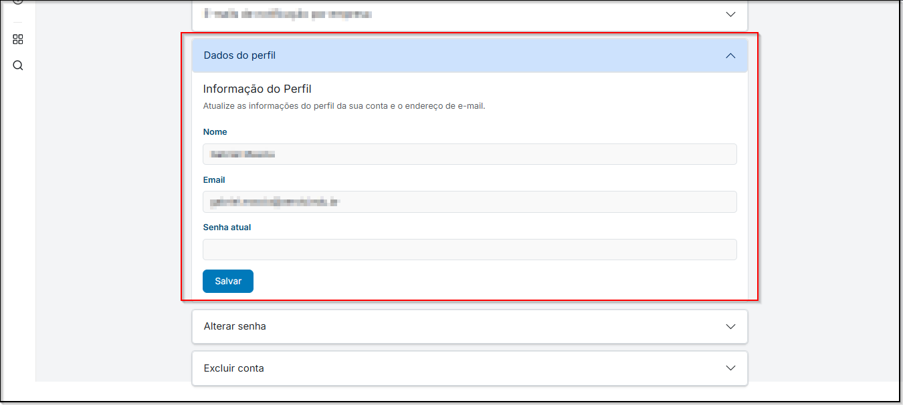
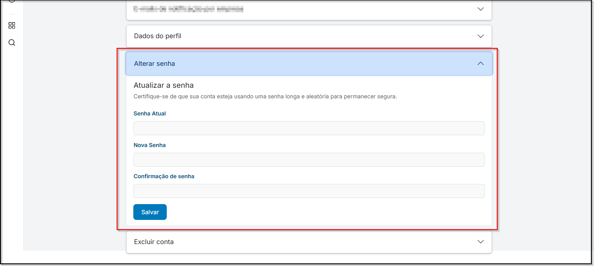
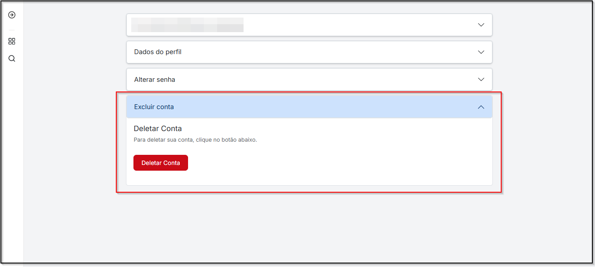

# <i data-lucide="pen" class="icon-lg"></i> Edição do Perfil de Candidato

### <i data-lucide="target" class="icon-lg"></i> Objetivo

Editar informações do perfil, como **Dados pessoais**, **Alterar senha**, e **Exclusão de conta**.

---

### <i data-lucide="square-check" class="icon-lg"></i> Pré-requisitos

- Ter uma **conta criada** no sistema como conta pessoal.
- Estar logado com **perfil pessoal**.
- Acesse a página de [Meu perfil](https://www.https://redeaviacao.com.br/perfil)

---

### <i data-lucide="notebook-pen" class="icon-lg"></i> Passo a passo

1. **Acesse o menu a direita e clique em `Meu Perfil`.**

2. **Editar Dados Pessoais** 
    - Em **``Dados Pessoais``**, é possível alterar o seu nome e e-mail cadastrados na plataforma. 
    - Por medidas de segurança, para confirmar qualquer alteração será necessário **inserir sua senha atual**.
    
    
3. **Alterar Senha**
    - Acesse a aba **``Alterar Senha``**. 
    - Informe a sua **senha atual** para poder trocar a senha. 
    - Após a inserção da senha atual, você deverá **inserir e confirmar a nova senha**. 
    - Clique em **`Salvar`** para aplicar as alterações.
    - A nova senha deve conter **pelo menos 8 caracteres**, incluindo **letras e números**.
    

4. **Excluir Conta**
    - Na aba **`Deletar Conta`** você poderá **excluir a sua conta permanentemente**, removendo todos os dados do sistema.
    - Essa ação é **irreversível** — suas candidaturas e informações cadastradas serão apagadas.
    - Confirme a exclusão apenas se tiver certeza de que deseja prosseguir.
    

---

### <i data-lucide="wrench" class="icon-lg"></i> Solução de problemas

??? "Alterações não aparecem após salvar"
    - Atualize a página (CTRL + F5)
    - Saia e entre novamente no sistema
    - Limpe o cache do navegador, se necessário

??? "Não consigo alterar senha"
    - Certifique-se de inserir corretamente a senha atual antes de definir a nova
    - Verifique se a nova senha atende aos critérios de segurança (mínimo de caracteres, letras e números)
    - Se o problema persistir, tente redefinir a senha pela opção “Esqueci minha senha” na tela de login

??? "Erro ao atualizar dados pessoais"
    - Confirme se todos os campos obrigatórios estão preenchidos
    - Verifique se o formato do e-mail está correto
    - Lembre-se de inserir a senha atual para confirmar as alterações

??? "Não consigo deletar minha conta"
    - Verifique se você está logado com o perfil correto
    - Certifique-se de não ter tarefas ou processos seletivos ativos vinculados à conta
    - Caso o botão não funcione, tente novamente após atualizar a página

---

### <i data-lucide="lightbulb" class="icon-dica"></i> Dicas

- Sempre confirme o novo e-mail adicionado para garantir o recebimento de notificações
- Atualize seus dados pessoais sempre que houver mudança de nome ou contato
- Ao alterar a senha, escolha combinações seguras e únicas
- Revise atentamente antes de salvar para evitar erros de digitação
- Evite exclusão da conta sem realizar backup das informações importantes
- Após qualquer modificação, recarregue a página e confirme se as alterações foram aplicadas corretamente