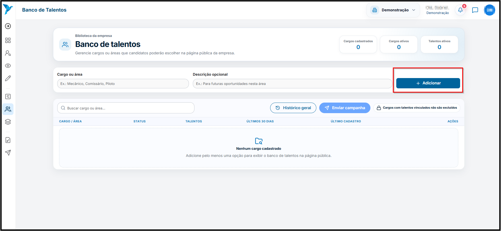
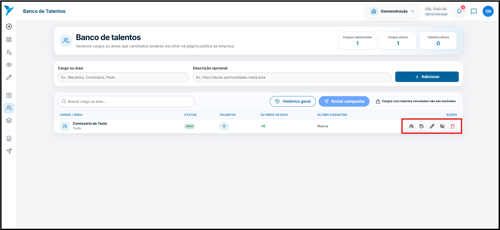
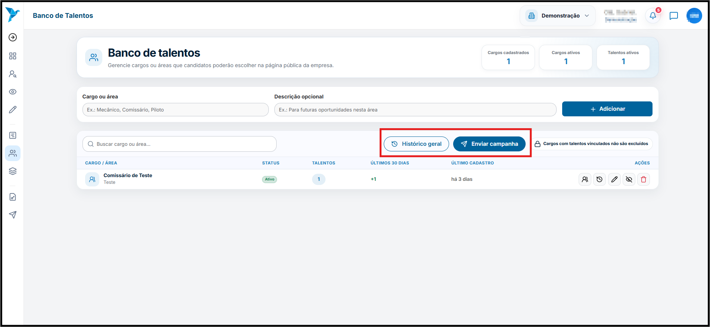
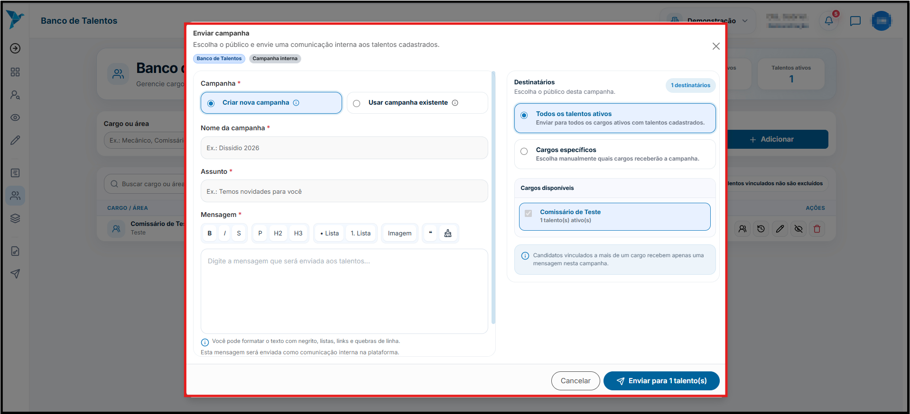
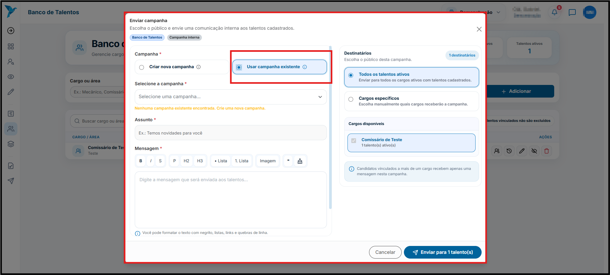

# <i data-lucide="database" class="icon-lg"></i> Banco de Talentos

### <i data-lucide="target" class="icon-lg"></i> Objetivo

Consultar o **Banco de Talentos** para localizar profissionais cadastrados na plataforma, utilizando filtros de pesquisa para encontrar candidatos compatíveis com as necessidades da empresa.

---

### <i data-lucide="square-check" class="icon-lg"></i> Pré-requisitos

- Ter uma **conta criada** no sistema.
- Estar logado com um **perfil empresarial**.
- Possuir permissão para acessar o Banco de Talentos.
- Acessar o menu lateral e clicar em **`Banco de Talentos`** ou acessar a página em [Banco de Talentos](https://redeaviacao.com.br/empresa/banco-de-talentos)

---

## <i data-lucide="pen" class="icon-lg"></i> Criar Banco de Talentos

---

### <i data-lucide="notebook-pen" class="icon-lg"></i> Passo a passo

1. **Acesse o menu `Banco de Talentos`.**
2. **Clique no botão `Adicionar` para criar um cargo/área.**
      - **Para criar uma campanha é necessário ter algum cargo criado**
      
3. **No campo `Ações` é possível verificar algumas informações sobre o cargo criado.**
      - Ver Candidatos
      - Ver Campanhas do cargo
      - Editar Cargo
      - Desativar Cargo
      - Excluir Cargo
    
4. **Para enviar uma campanha, selecione o cargo desejado e preencha os campos necessários.**
    - **Nome da campanha**: Informe um título que descreva a campanha.
    - **Assunto**: Forneça um assunto que resuma a campanha.
    - **Mensagem**: Escreva uma mensagem clara e objetiva para os candidatos.
    - **Anexo da campanha**: Caso necessário, anexe arquivos relevantes à campanha.
      
5. **Selecione os destinatários da campanha, eles podem ser:**
    - **Todos os talentos ativos**: Envia a campanha para todos os candidatos cadastrados no Banco de Talentos.
    - **Cargos específicos**: Permite escolher candidatos específicos para receber a campanha.
      
6. **Caso queria utilizar uma campanha já existente, é possível selecionar uma campanha salva no sistema. Basta clicar em ``Usar campanha existente`` e escolher a campanha desejada.**
    
---

### <i data-lucide="wrench" class="icon-lg"></i> Solução de problemas

??? "**Nenhum candidato encontrado**"
    - Revise os filtros aplicados.
    - Amplie os critérios da pesquisa para obter mais resultados.
    - Verifique se existem candidatos cadastrados que atendam aos requisitos.

??? "**Não consigo acessar o Banco de Talentos**"
    - Confirme se seu usuário possui permissão para acessar a funcionalidade.
    - Atualize a página (CTRL + F5).
    - Faça login novamente no sistema.

??? "**Erro ao carregar os candidatos**"
    - Verifique sua conexão com a internet.
    - Atualize a página.
    - Caso o problema persista, entre em contato com o suporte.

---

### <i data-lucide="lightbulb" class="icon-dica"></i> Dicas

- Utilize filtros específicos para localizar candidatos com maior rapidez.
- Evite aplicar muitos filtros simultaneamente quando estiver realizando buscas exploratórias.
- Mantenha uma estratégia de busca utilizando critérios técnicos da vaga.
- Revise periodicamente os candidatos disponíveis no Banco de Talentos, pois novos perfis podem ser cadastrados continuamente.