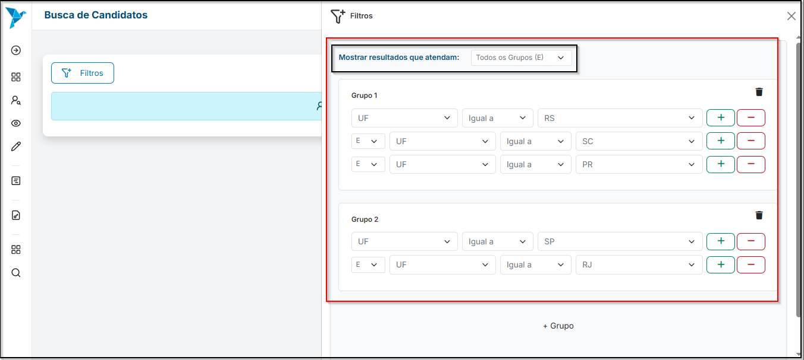
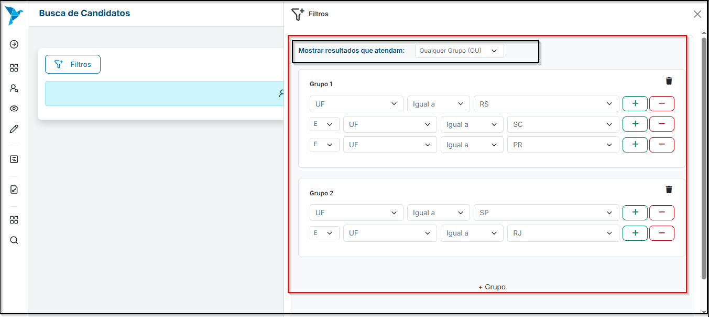
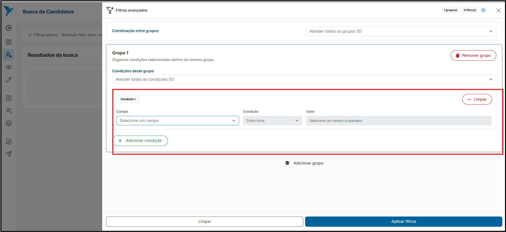
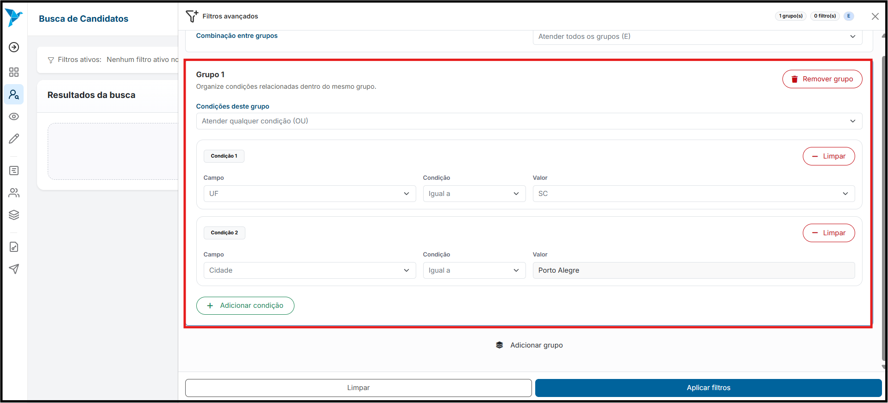
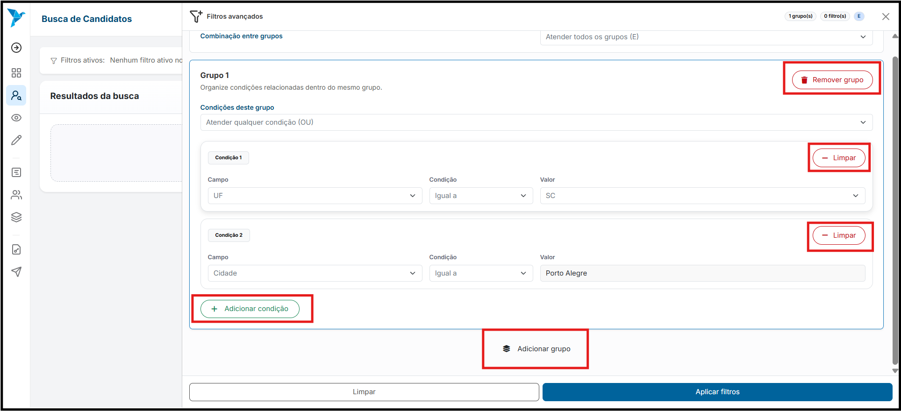

# <i data-lucide="funnel-plus" class="icon-lg"></i> Busca de Candidatos

### <i data-lucide="target" class="icon-lg"></i> Objetivo

Utilizar filtros avançados para localizar candidatos de acordo com critérios específicos, como **formação, localização, idade, idiomas, licenças**, entre outros.

---

### <i data-lucide="square-check" class="icon-lg"></i> Pré-requisitos

- Ter uma **conta criada** no sistema (via cadastro).
- Estar logado com um **perfil empresarial**.
- Acessar o menu lateral e clicar em **`Busca de Candidatos`** ou acesse a página de [Candidatos](https://redeaviacao.com.br/candidatos).

---

### <i data-lucide="notebook-pen" class="icon-lg"></i> Passo a passo

1. **Clique no botão `Filtros` para abrir a tela de filtros de candidatos.**

2. **Defina a opção em ``Mostrar resultados que atendam``.**
      - **Todos os Grupos (E):** o candidato precisa atender a **todos** os critérios definidos.
        - Se estiver marcado como **"E"** , e conter dois grupos ou mais, o resultado vai filtrar as informações se atender ambos os grupos. *(Ex. Quero filtrar os estados de RS, SC, PR que estão no **``Grupo 1``**, **E** quero filtrar o candidato que tenha idade entre 18 e 50 anos no **``Grupo 2``**. Logo o filtro irá mesclar os dois grupos, filtrando entre os estados RS, SC, PR e candidatos que tenham idade entre 18 e 50 anos).*
        
      - **Qualquer Grupo (OU):** o candidato pode atender a **um ou mais** dos critérios definidos.
        - Se tiver marcado como **"OU"**, será filtro um/ou mais grupos. *(Ex. Quero filtrar os estados de RS, SC, PR que estão no **``Grupo 1``** **OU** filtrar o candidato que tenha idade entre 18 e 50 anos no **``Grupo 2``**. O filtro irá filtrar os campos RS, SC e PR e irá filtrar por candidatos que possuem uma idade entre 18 e 50 anos).*
        

3. **Nos grupos, os filtros estão divididos em tópicos**
    - **Dados Pessoais** é possivel filtrar candidatos por *nome, e-mail, tipo de currículo, cidade, UF, idade e gênero*. 
    - **Formação e Idiomas** é possível filtrar entre *nível de formação, idiomas e inglês (ICAO)* 
    - **Piloto** filtra pelo tipo de licença que o piloto possuí
    - **Mecânico** filtra pela qualificação do mecânico
    - **Aeronaves** filtra por *fabricante, família da aeronave, tipo de aeronave e categoria da aeronave*.
    - **Horas Totais** filtra pelas horas totais de: *voo, em comando, IFR, como copiloto (SIC), em jatos, em turbina, de multimotor, em monomotor, em horas noturnas* 
    - **Experiência por motorização** filtra pelas *horas totais como copiloto (SIC) em jatos* e *horas totais como copiloto (SIC ) em turbina*
    - **Experiência de Linhas Áeras** filtra por: *Tempo em serviço de linha Aérea (RBAC 121), Tempo em serviço de Táxi Aéreo (RBAC 135), Horas de voo em Linhas Aéreas (RBAC 121), Horas de voo em Táxi Aéreo (RBAC 135), Tempo de serviço como Instrutor de Voo (RBAC 141) e Horas de voo como Instrutor de Voo (RBAC 141)*
    - **Qualificações Operacionais** filtra pela função operacional do candidato (Instrutor, Checador...)
    - **Documentação Internacional** filtra por *Visto Americano, Passaporte Europeu, Licença de Piloto de Linha Aérea (ANAC), Licença de Piloto de Linha Aérea (ATP FAA EUA), Licença de Piloto de Linha Aérea (ATP EASA EUR)*
    - **Experiência Internacional** filtra por experiências em voos internacionais *(Europa, Ásia, Américas, Oceania e África)*
    - **Disponibilidade** filtra por *disponibilidade para viagens, disponibilidade para mudança, se está empregado atualmente*
    - **CMA** filtra por candidatos que possuem certificações da CMA e qual é a Classe do CMA
          

4. **Em ``Condição``, defina a condição de comparação**
      - **Contém**
      - **Igual a**
      - **Não contém**
      - **Maior que**
      - **Menor que**
      - **Entre**
      
  
5. **Em ``Valor``, insira o critério a ser buscado** 

      - Com o filtro **"E"** dentro do Grupo será filtrado se o candidato **possuir as duas condições** especificadas (ex.: Cidade = São Paulo **E** Idade entre 18 e 22).
      

      - Com o filtro **"OU"** dentro do Grupo será filtrado se o candidato possuir **uma ou mais condições** especificadas, independente se ela possuem vínculo ou não (ex.: UF = SC **OU** Cidade = Porto Alegre).
      

6. **Caso necessário, clique em `Adicionar Condição` para adicionar mais condições dentro do mesmo grupo.**
    
7. **Para adicionar um novo grupo de regras, clique em `Adicionar Grupo` e configure novos filtros.**

8. **Caso queira excluir algum parametro, clique no simbolo ``- Limpar``.**

9.  **Após configurar os filtros, clique em `Aplicar filtros` para visualizar os candidatos que atendem aos critérios.**

- 

---

### <i data-lucide="wrench" class="icon-lg"></i> Solução de problemas

??? "**Nenhum candidato encontrado**"
    - Revise os critérios aplicados; filtros muito restritivos podem reduzir os resultados.
    - Tente usar operadores mais amplos (ex.: "Contém" ao invés de "Igual a").
    - Combine grupos com a opção **Qualquer Grupo (OU)** para ampliar os resultados.

??? "**Erro ao aplicar filtros**"
    - Verifique se todos os campos obrigatórios foram preenchidos.
    - Certifique-se de que os valores inseridos correspondem ao tipo do campo (ex.: Idade deve ser um número).

??? "**Filtros não são aplicados**"
    - Atualize a página (CTRL + F5).
    - Saia e entre novamente no sistema.
    - Limpe o cache do navegador, se necessário.

---

### <i data-lucide="lightbulb" class="icon-dica"></i> Dicas

- Use **combinações de grupos** para refinar a busca (ex.: Idioma = Inglês **E** Formação = Engenharia).
- Utilize **operadores lógicos** (E/OU) de acordo com a necessidade:
    - E = restringe os resultados.
    - OU = amplia os resultados.
- Prefira **critérios objetivos** como idade, cidade ou licenças para buscas mais assertivas.
- Use **tags personalizadas** para organizar candidatos por perfis específicos.
- Revise sempre os filtros aplicados antes de iniciar uma nova busca.
