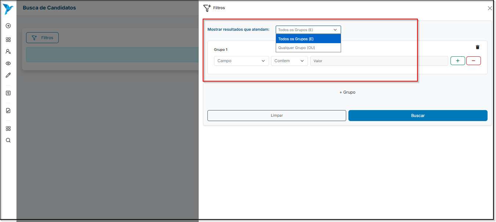
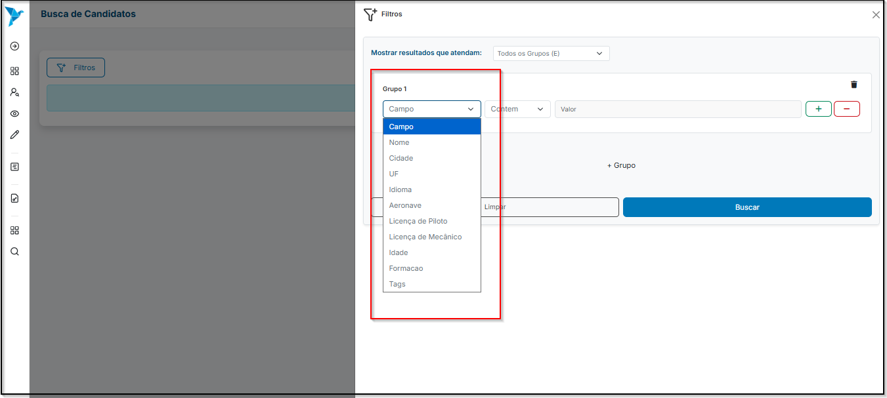
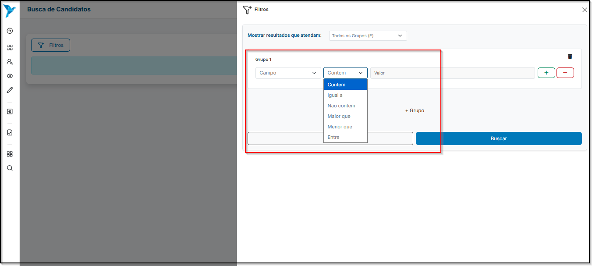

# <i data-lucide="funnel-plus" class="icon-lg"></i> Busca de Candidatos

### <i data-lucide="target" class="icon-lg"></i> Objetivo

Utilizar filtros avançados para localizar candidatos de acordo com critérios específicos, como formação, localização, idade, idiomas, licenças, entre outros.

---

### <i data-lucide="square-check" class="icon-lg"></i> Pré-requisitos

- Ter uma **conta criada** no sistema (via cadastro).
- Estar logado com um perfil **empresarial**.
- Acessar o menu lateral e clicar em **`Busca de Candidatos`** ou acesse a página de [Candidatos](https://redeaviacao.com.br/candidatos).

---

### <i data-lucide="notebook-pen" class="icon-lg"></i> Passo a passo

1. **Clique no botão `Filtros` para abrir a tela de filtros de candidatos.**

2. **Defina a opção em ``Mostrar resultados que atendam``.**
      - **Todos os Grupos (E):** o candidato precisa atender a **todos** os critérios definidos.
      - **Qualquer Grupo (OU):** o candidato pode atender a **um ou mais** dos critérios definidos.
      

3. **Em ``Grupo 1``, configure**
      - **Campo:** selecione uma das opções abaixo para serem filtradas: 
           - **Nome** (filtra pelo nome do candidato)
           - **Cidade** (filtra pela cidade em que o candidato reside)
           - **UF** (filtra pela unidade onde o candidato nasceu/reside)
           - **Idioma** (filtra pelos idiomas que o candidato informa no currículo)
           - **Aeronave** (filtra pelos tipos de aeronave que o candidato está apto a pilotar)
           - **Licença de Piloto** (filtra pela licença de piloto)
           - **Licença de Mecânico** (filtra pela licença de mecânico)
           - **Idade** (filtra pela idade)
           - **Formação** (filtra pela formação do candidato)
           - **Tags**
           

4. **Em ``Operador``, defina a condição de comparação**
      - **Contém**
      - **Igual a**
      - **Não contém**
      - **Maior que**
      - **Menor que**
      - **Entre**
      
  
5. **Em ``Valor``, insira o critério a ser buscado** 
      - (ex.: Cidade = São Paulo, Idioma = Inglês Avançado, Idade > 25).

6. **Caso necessário, clique em `+` para adicionar mais condições dentro do mesmo grupo.**
    - 

7. **Para adicionar um novo grupo de regras, clique em `+ Grupo` e configure novos filtros.**

8. **Após configurar os filtros, clique em `Buscar` para visualizar os candidatos que atendem aos critérios.**

9. **Se desejar limpar todos os filtros e recomeçar, clique em `Limpar`.**

10. **Caso queira excluir apenas um grupo, clique no simbolo da lixeira no canto superior direito do grupo no qual deseja excluir.**

---

### <i data-lucide="wrench" class="icon-lg"></i> Solução de problemas

??? "**Nenhum candidato encontrado**"
    - Revise os critérios aplicados; filtros muito restritivos podem reduzir os resultados.
    - Tente usar operadores mais amplos (ex.: "Contém" ao invés de "Igual a").
    - Combine grupos com a opção **Qualquer Grupo (OU)** para ampliar os resultados.

??? "**Erro ao aplicar filtros**"
    - Verifique se todos os campos obrigatórios foram preenchidos.
    - Certifique-se de que os valores inseridos correspondem ao tipo do campo (ex.: Idade deve ser um número).

??? "**Filtros não são aplicados**"
    - Atualize a página (CTRL + F5).
    - Saia e entre novamente no sistema.
    - Limpe o cache do navegador, se necessário.

---

### <i data-lucide="lightbulb" class="icon-dica"></i> Dicas

- Use **combinações de grupos** para refinar a busca (ex.: Idioma = Inglês **E** Formação = Engenharia).
- Utilize **operadores lógicos** (E/OU) de acordo com a necessidade:
    - E = restringe os resultados.
    - OU = amplia os resultados.
- Prefira **critérios objetivos** como idade, cidade ou licenças para buscas mais assertivas.
- Use **tags personalizadas** para organizar candidatos por perfis específicos.
- Revise sempre os filtros aplicados antes de iniciar uma nova busca.
