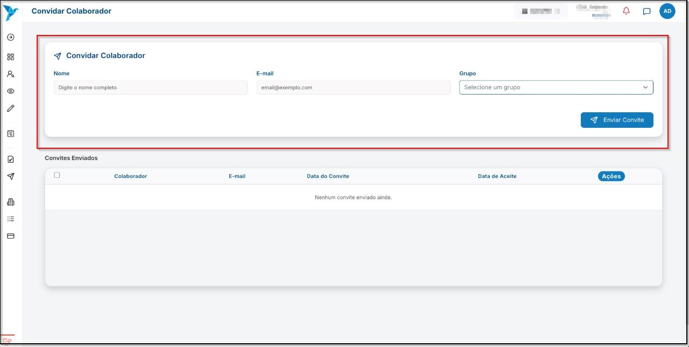
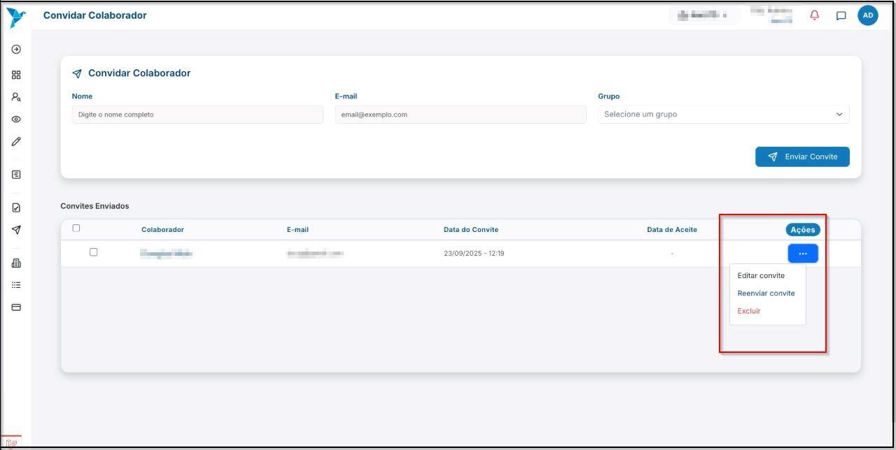
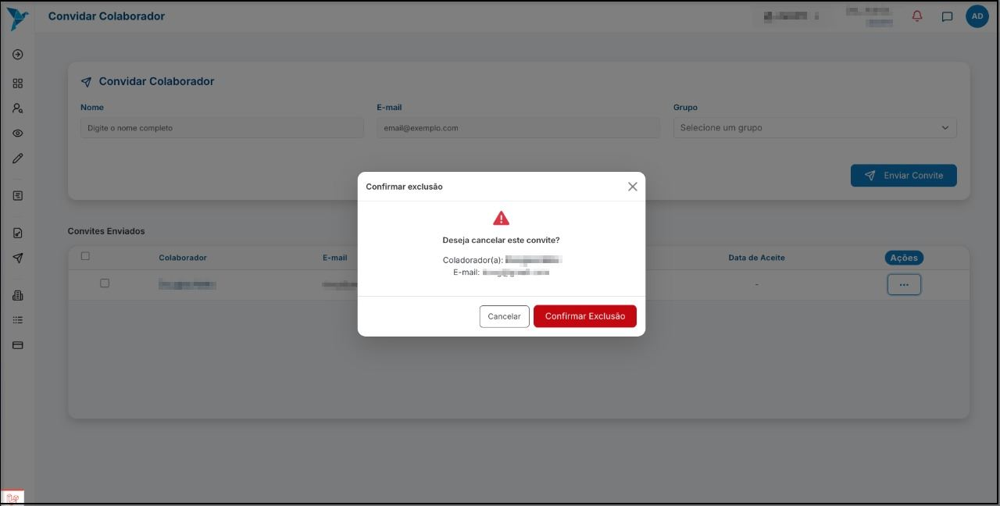

# <i data-lucide="check" class="icon-lg"></i> Convidar Colaborador

## <i data-lucide="target" class="icon-lg"></i> Objetivo

Convidar um colaborador para exercer uma outra função na empresa.

---

## <i data-lucide="square-check" class="icon-lg"></i> Pré-requisitos

- Ter uma **conta criada** no sistema (via cadastro).
- Estar logado com um perfil empresarial.
- Ter permissões de convite.
- Acesse a página de [Convites](https://www.redeaviacao.com.br/empresa/convites)

---

## <i data-lucide="notebook-pen" class="icon-lg"></i> Passo a passo

1. **Clicar no ``Convites de Colaboradores`` localizado no menu suspenso à esquerda.**

2. Informar o **nome, e-mail e selecionar o grupo** no qual deseja convidar o colaborador.
    

3. **Após preencher, clicar em ``Enviar convite``.**

4. **Caso deseje editar, reenviar ou remover o convite, basta clicar nos `...` em ``Ações`` e selecione a opção desejada.**
    

5. **Para remover, é necessário clicar em ``Confirmar Exclusão`` para realizar a exclusão do convite.**
            

---

## <i data-lucide="wrench" class="icon-lg"></i> Solução de problemas

??? "**O e-mail não chegou para o colaborador**"
    - Selecione o colaborador que não recebeu o e-mail, clique em **``Ações``** e selecione a opção **``Reenviar convite``**.

## <i data-lucide="lightbulb" class="icon-dica"></i> Dicas

- Confirme o e-mail do colaborador antes de enviar o convite, evitando erros de digitação.

- Defina corretamente o grupo ou função para garantir que o colaborador tenha apenas os acessos necessários.

- Para funções sensíveis, limite permissões somente ao que for realmente necessário.

- Se o colaborador não aceitar o convite imediatamente, você pode reenviar o convite a qualquer momento.

- Caso o convite tenha sido enviado para o e-mail errado, é possível cancelá-lo e reenviar para o endereço correto.

- Mantenha a lista de colaboradores sempre atualizada, removendo usuários inativos para maior segurança.

- Se a empresa tiver muitas áreas, organize os convites usando grupos diferentes (ex.: RH, Financeiro, Recrutamento).