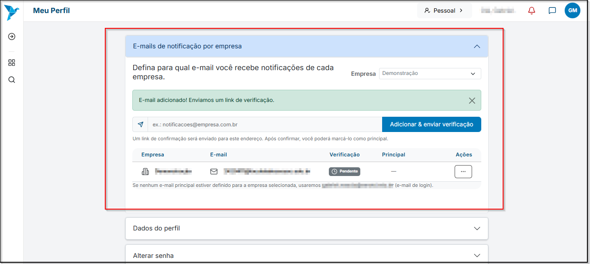
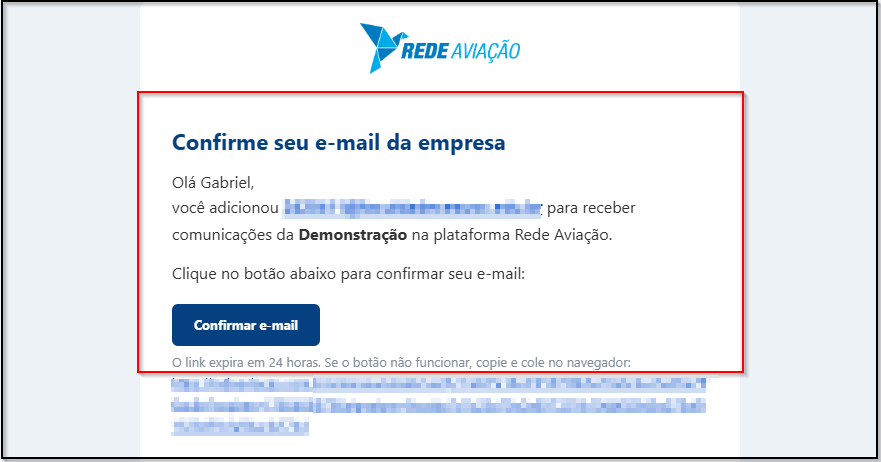
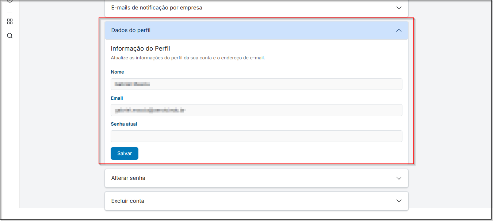
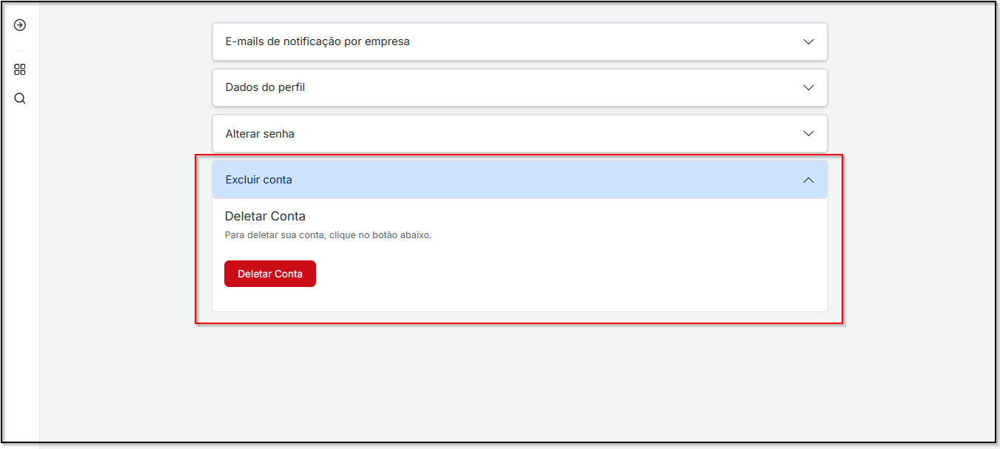

# <i data-lucide="pen" class="icon-lg"></i> Edição do Perfil de Recrutador

### <i data-lucide="target" class="icon-lg"></i> Objetivo

Editar informações do perfil, como **Dados pessoais**, **Alterar senha**, **Alterar e-mail no qual recebe as notificações** e **Exclusão de conta**.

---

### <i data-lucide="square-check" class="icon-lg"></i> Pré-requisitos

- Ter uma **conta criada** no sistema como **recrutador** (via cadastro ou convite de empresa).
- Estar logado com **perfil de empresa / recrutador**.
- Acesse a página de [Meu perfil](https://www.https://redeaviacao.com.br/perfil)

---

### <i data-lucide="notebook-pen" class="icon-lg"></i> Passo a passo

1. **Acesse o menu a direita e clique em `Meu Perfil`.**

2. **E-mails de notificação por empresa**

    - No campo **`E-mails de notificação por empresa`**, insira o endereço de e-mail que deverá receber as notificações da empresa.  
    - Após inserir o e-mail, clique em **`Adicionar & Enviar Verificação`** para disparar um e-mail com o link de confirmação.  
    
     - No e-mail recebido, clique em **`Confirmar`** para validar o endereço.
    
     - **Observação: o e-mail só passará a receber notificações após a confirmação.**

3.  **Dados Pessoais**  
    - Em **`Dados Pessoais`**, você pode alterar **nome** e **e-mail** cadastrados na plataforma.  
    - Por segurança, ao salvar alterações será solicitado que você informe sua **senha atual** para confirmar a operação.  
    
    
4. **Alterar Senha**  
    - Acesse a aba **`Alterar Senha`**, informe a **senha atual**, defina a **nova senha** e confirme-a.  
    - Clique em **`Salvar`** para aplicar a alteração.  
    - Requisitos recomendados: **mínimo de 8 caracteres**, incluindo **letras e números**. 
    

5. **Deletar Conta**  
    - Em **`Deletar Conta`** você pode excluir sua conta **permanentemente**, removendo todos os dados vinculados à conta.  
    - Essa ação é **irreversível**; verifique dependências (vagas ativas, processos seletivos) antes de prosseguir.  
    - O sistema solicitará confirmação adicional (e, possivelmente, a senha) antes de concluir a exclusão.  
    

---

### <i data-lucide="wrench" class="icon-lg"></i> Solução de problemas

??? "Alterações não aparecem após salvar"
    - Atualize a página (CTRL + F5)
    - Saia e entre novamente no sistema
    - Limpe o cache do navegador, se necessário

??? "Erro ao adicionar ou confirmar e-mail de notificação"
    - Verifique se o endereço de e-mail foi digitado corretamente
    - Confirme se o e-mail de verificação não foi enviado para a caixa de spam
    - Caso o link de confirmação tenha expirado, repita o processo de adicionar o e-mail

??? "Não consigo alterar senha"
    - Certifique-se de inserir corretamente a senha atual antes de definir a nova
    - Verifique se a nova senha atende aos critérios de segurança (mínimo de caracteres, letras e números)
    - Se o problema persistir, tente redefinir a senha pela opção “Esqueci minha senha” na tela de login

??? "Erro ao atualizar dados pessoais"
    - Confirme se todos os campos obrigatórios estão preenchidos
    - Verifique se o formato do e-mail está correto
    - Lembre-se de inserir a senha atual para confirmar as alterações

??? "Não consigo deletar minha conta"
    - Verifique se você está logado com o perfil correto (empresa ou recrutador)
    - Certifique-se de não ter tarefas ou processos seletivos ativos vinculados à conta
    - Caso o botão não funcione, tente novamente após atualizar a página

---

### <i data-lucide="lightbulb" class="icon-dica"></i> Dicas

- Sempre confirme o novo e-mail adicionado para garantir o recebimento de notificações
- Utilize um e-mail corporativo para manter a comunicação mais profissional
- Atualize seus dados pessoais sempre que houver mudança de nome ou contato
- Ao alterar a senha, escolha combinações seguras e únicas
- Revise atentamente antes de salvar para evitar erros de digitação
- Evite exclusão da conta sem realizar backup das informações importantes
- Após qualquer modificação, recarregue a página e confirme se as alterações foram aplicadas corretamente