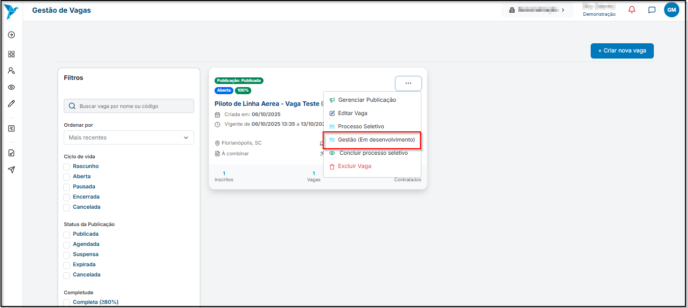
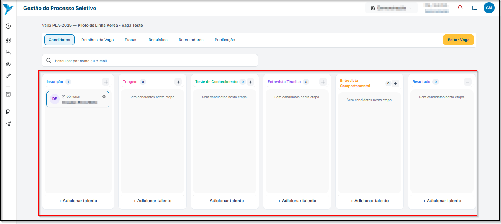
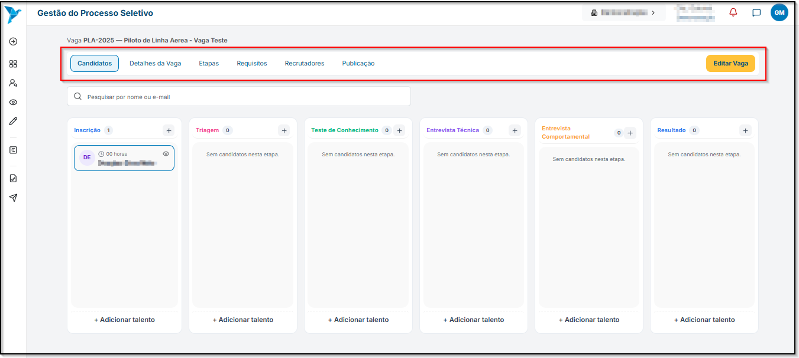

# <i data-lucide="kanban" class="icon-lg"></i> Gestão do Processo Seletivo

### <i data-lucide="target" class="icon-lg"></i> Objetivo

Ensinar como gerir o processo seletivo no Rede Aviação.

---

### <i data-lucide="square-check" class="icon-lg"></i> Pré-requisitos

- Ter uma **conta criada** no sistema (via cadastro).
- Estar logado com um **perfil empresarial**.
- Acesse a página de [Vagas Abertas](https://redeaviacao.com.br/empresa/vagas)

---

### <i data-lucide="notebook-pen" class="icon-lg"></i> Passo a passo

1. **Clicar em ``...`` e selecionar a opção `Gestão` para acessar a tela de `Gestão do Processo Seletivo`.**
    - 

2. Cada coluna representa uma etapa do processo seletivo, baseada na metodologia ágil do **``Kanban``**. **O recrutador pode mover o candidato entre as etapas apenas ao arrastar o ícone de cada candidato.**
    - 

3. **O menu em cima é divido em abas**, separando em tópicos para facilitar a consulta das informações da vaga.

    - 

---

### <i data-lucide="wrench" class="icon-lg"></i> Solução de problemas

??? "**Os candidatos não aparecem nas etapas**"
    - Verifique se há candidatos cadastrados na vaga.
    - Atualize a página pressionando **`CTRL + F5`**.
    - Caso o problema persista, revise os **filtros de visualização** aplicados (alguns podem ocultar resultados).

??? "**Não consigo mover o candidato para outra etapa**"
    - Confirme se você possui **permissões de edição** na vaga.
    - Certifique-se de **clicar e arrastar** o card do candidato corretamente até a próxima etapa.
    - Evite mover candidatos para etapas que não estão habilitadas.

??? "**Botão de ``Editar Vaga`` não funciona**"
    - Atualize a página e tente novamente.
    - Verifique se a vaga ainda está **ativa** (vagas encerradas bloqueiam edição).
    - Se persistir, limpe o **cache do navegador** ou tente acessar em aba anônima.

??? "**A aba de candidatos está vazia**"
    - Garanta que a vaga selecionada possui **inscrições vinculadas**.
    - Verifique se a visualização está configurada para mostrar **todas as etapas**.

---

### <i data-lucide="lightbulb" class="icon-dica"></i> Dicas

- Utilize o **Kanban** para acompanhar o progresso de cada candidato de forma visual e organizada.  
- Mova candidatos entre as etapas **arrastando o card** — isso facilita o controle do fluxo seletivo.  
- Use o campo de busca para **encontrar candidatos rapidamente** pelo nome ou e-mail.  
- Clique em **`Editar Vaga`** para ajustar detalhes da vaga sem sair da tela de gestão.  
- Mantenha as etapas atualizadas para evitar confusões na análise de candidatos.  
- Adicione anotações internas ou comentários para **registrar o histórico** de cada candidato.  
- Utilize cores e nomes claros para as etapas, facilitando a leitura da equipe de recrutamento.  
