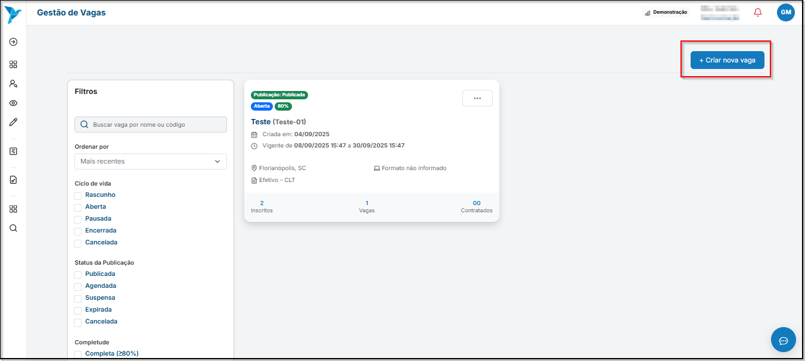
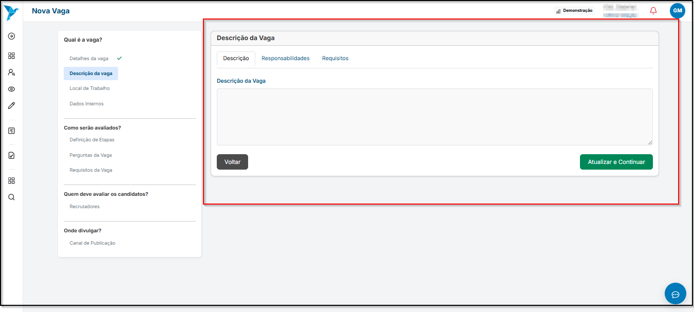
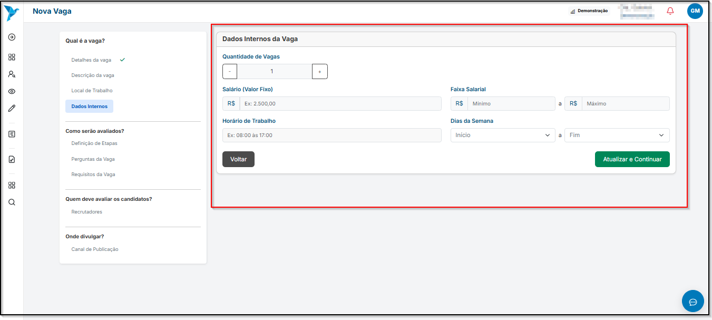
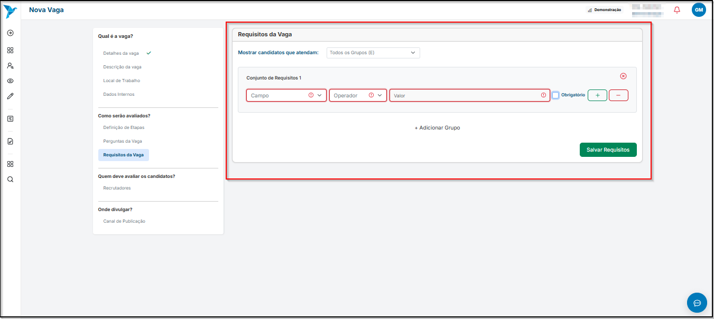
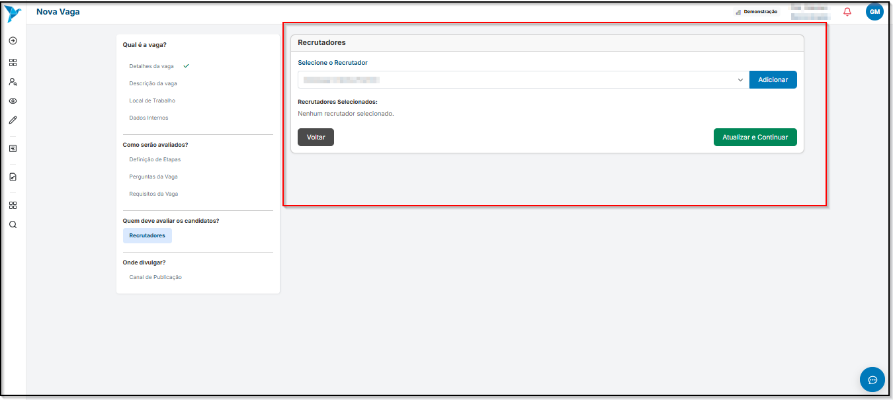
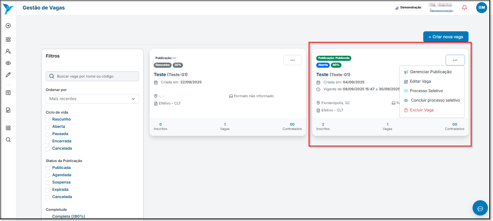

# <i data-lucide="cog" class="icon-lg"></i> Gerenciamento de Vagas

## <i data-lucide="target" class="icon-lg"></i> Objetivo Geral

Gerenciar as vagas para buscar novos colaboradores.

---

## <i data-lucide="check" class="icon-lg"></i> Cadastro de Vagas

---

### <i data-lucide="square-check" class="icon-lg"></i> Pré-requisitos

- Ter uma **conta criada** no sistema (via cadastro).
- Estar logado com um perfil empresarial.
- Acesse a página de [Vagas Abertas](https://redeaviacao.com.br/empresa/vagas)

---

### <i data-lucide="notebook-pen" class="icon-lg"></i> Passo a passo

1. Clicar em **`Gestão de Vagas`** no menu suspenso à esquerda.

2. Clicar em **``Criar nova vaga``**
    - Selecionar um template de vaga pré-definido. Caso a vaga não se encaixe em nenhuma das opções, clique em **`Outros`**.
    - Após definir o template, clique em **`Criar vaga`** para avançar para os detalhes da vaga.
    
 
3. Em **Detalhes da vaga**, informe:
    - Título da vaga (título que será divulgado)
    - Código da vaga (ex.: PIL-2025-001, conforme padrão da empresa)
    - Cargo (especificar qual é o cargo para vaga)
    - Área de atuação (especificar a área de atuação)
    - Tipo de contrato (CLT, PJ, estágio, etc.)
    - Formato de trabalho (presencial, remoto ou híbrido)
    - Marque se a vaga também será destinada a PCDs
    

4. Em **Descrição da vaga**, informe:
    - Descrição completa da vaga, incluindo benefícios e informações relevantes para atrair candidatos
    - Responsabilidades do profissional que ocupará a vaga
    - Requisitos necessários, como formação acadêmica, cursos, certificações e experiências desejadas
    

5. Em **Localização da vaga**, informe:
    - CEP
    - Rua
    - Número
    - Cidade
    - Estado
    - 

6. Em **Dados internos da vaga**, informe:
    - Quantidade de vagas (especificar o números de vagas para aquele cargo)
    - Salário fixo (caso haja um salário fixo para vaga)
    - Faixa salarial (caso haja)
    - Horário de trabalho (informar quais são os horários de trabalho)
    - Dias da semana (informar as escalas de trabalho)
    

7. Em **Definição de etapas**, informe quais são as etapas do processo seletivo que os candidatos deverão passar
    - Exemplos: Inscrição, Triagem, Teste de Conhecimento, Entrevista Técnica, Entrevista Comportamental e Resultado.
    - Caso necessário, crie novas etapas personalizadas de acordo com o processo seletivo da empresa.
    

8. Em **Perguntas da vaga**, informe:
    - Tipo da pergunta a ser feita ao candidato **(ex.: múltipla escolha, dissertativa, sim/não)**
    - Enunciado claro e objetivo.
    - Defina se a pergunta será obrigatória ou opcional.
    - Clique em **`Salvar Pergunta`** para registrar.
    - Todas as perguntas cadastradas ficarão listadas na seção **Perguntas Cadastradas**, onde poderão ser consultadas, editadas ou removidas.
    

9. Em **Requisitos da vaga**, informe:
    - Defina se deseja mostrar candidatos que atendam a todos os grupos de requisitos (E) ou a qualquer grupo (OU)
    - No Conjunto de Requisitos, selecione:
            - **Campo:** a informação do candidato que será avaliada (ex.: formação, experiência, idioma)
            - **Operador:** a condição de comparação (ex.: igual, maior que, contém)
            - **Valor:** o critério esperado (ex.: inglês avançado, 2 anos de experiência)
    - Marque se o requisito será obrigatório para participação no processo.
    - Caso necessário, clique em **`Adicionar Grupo`** para criar combinações de requisitos.
    - Após configurar, clique em **`Salvar Requisitos`**.
    

10. Em **Recrutadores**, informe:
    - No campo **`Selecione o Recrutador`**, escolha o colaborador responsável por avaliar os candidatos
    - Clique em **`Adicionar`** para incluir o recrutador na lista
    - Caso queira adicionar mais de um responsável, repita o processo para cada recrutador
    - Os recrutadores selecionados ficarão listados em **Recrutadores Selecionados**
    - Após finalizar, clique em **`Atualizar e Continuar`**.
    

---

## <i data-lucide="pen" class="icon-lg"></i> Edição de Vagas

---

### <i data-lucide="square-check" class="icon-lg"></i> Pré-requisitos

- Ter uma **conta criada** no sistema (via cadastro ou convite de empresa).
- Estar logado com um perfil empresarial.
- Acesse a página de [Vagas Abertas](https://www.redeaviacao.com.br/empresa/vagas)

---

### <i data-lucide="notebook-pen" class="icon-lg"></i> Passo a passo

1. Clicar em **`Gestão de Vagas`** no menu suspenso à esquerda.
2. Selecionar a vaga que deseja editar, clicar em **`...`** e selecionar a opção **`Editar Vaga`**.

3. Realizar as edições necessárias.
4. Clicar em **`Atualizar e Continuar`** para confirmar e aplicar as alterações.

---

## <i data-lucide="trash" class="icon-lg"></i> Exclusão de Vagas

---

### <i data-lucide="square-check" class="icon-lg"></i> Pré-requisitos

- Ter uma **conta criada** no sistema (via cadastro ou convite de empresa).
- Estar logado com um perfil empresarial.
- Acesse a página de [Vagas Abertas](https://www.redeaviacao.com.br/empresa/vagas)

---

### <i data-lucide="notebook-pen" class="icon-lg"></i> Passo a passo

1. Clicar em **`Gestão de Vagas`** no menu suspenso à esquerda.
2. Selecionar a vaga que deseja editar, clicar em **`...`** e selecionar a opção **`Excluir Vaga`**.

3. Confirmar a exclusão da vaga.

---

## <i data-lucide="wrench" class="icon-lg"></i> Solução de problemas

??? "**Coloquei uma informação errada na vaga**"
    - Você pode editar a vaga clicando em **`Gestão de Vagas`**
    - Selecione a vaga que deseja editar, clique na caixa com `...` e clique em **`Editar Vaga`**

??? "**Erro ao cadastrar vaga**"
    - Verifique se todos os campos obrigatórios foram preenchidos antes de salvar
    - Certifique-se de que o código da vaga está no formato correto (ex.: PIL-2025-001)

??? "**Perguntas ou requisitos não salvos**"
    - Confirme que clicou em **`Salvar Pergunta`** ou **`Salvar Requisitos`** antes de avançar
    - Atualize a página caso o sistema não reflita as alterações imediatamente

??? "**Recrutador não aparece na lista**"
    - Verifique se o colaborador selecionado possui perfil de recrutador
    - Refaça a seleção e clique em **`Adicionar`**

??? "**Problemas com localização da vaga**"
    - Confirme se o CEP está correto
    - Caso seja uma vaga remota, marque corretamente a opção de trabalho remoto

??? "**Etapas do processo seletivo faltando ou incorretas**"
    - Edite a vaga e revise a **Definição de Etapas**
    - Adicione etapas personalizadas se necessário, respeitando a ordem lógica do processo

??? "**Editei errado a vaga e não quero confirmar as alterações**"

    - Clicar no botão **Cancelar Alterações** para remover todas as alterações que ainda não foram salvas.

??? "**Não consigo encontrar a opção de editar**"

    - Verifique se está logado com perfil de empresa.
    - Apenas vagas já criadas podem ser editadas.
    - Caso a vaga tenha sido arquivada ou removida, ela não aparecerá na lista.

??? "**Alterações não aparecem após salvar**"

    - Atualize a página (CTRL + F5)
    - Saia e entre novamente no sistema
    - Limpe o cache do navegador se necessário
    - Confirme se você clicou em **`Atualizar e Continuar`** e não apenas em salvar parcialmente

??? "**Problemas com campos obrigatórios**"

    - Certifique-se de que todos os campos obrigatórios (como título, código e localização) estão preenchidos corretamente antes de salvar.
    - Erros de formatação, como códigos de vaga incorretos, podem impedir a atualização.

??? "**Edição de vagas PCD ou remotas**"

    - Para vagas PCD, verifique se todos os campos de acessibilidade estão preenchidos corretamente.
    - Para vagas remotas, confirme se o tipo de trabalho está selecionado corretamente, pois isso impacta na exibição da vaga para candidatos.

---

## <i data-lucide="lightbulb" class="icon-dica"></i> Dicas

??? "**Dicas de criação de vagas**"

    - Descreva a vaga de forma clara e objetiva, incluindo funções, responsabilidades e requisitos.
    - Informe a localização e se a vaga é **remota, híbrida ou presencial**.
    - Se possível, adicione a faixa salarial para atrair candidatos mais alinhados.
    - Use palavras-chave no título e na descrição da vaga para facilitar que candidatos encontrem a oportunidade.
    - Defina com antecedência quem fará parte do processo seletivo **(recrutadores e avaliadores)**.
    - Revise os dados antes de publicar para evitar edições constantes.
    - Evite usar termos discriminatórios ou restritivos que possam excluir candidatos sem necessidade.
    - Caso receba muitos currículos, utilize os filtros de triagem do sistema para agilizar a seleção.
    - Sempre revise o **template de vaga** antes de criar para garantir que está adequado à posição
    - Use **benefícios e diferenciais** da empresa para tornar a vaga mais atrativa.
    - Evite termos vagos como “boa comunicação” ou “proativo” sem detalhar como isso se aplica à função.
    - Quando houver várias vagas semelhantes, utilize **códigos de vaga padronizados** para facilitar o gerenciamento.
    - Para processos seletivos complexos, crie **etapas detalhadas** e utilize **perguntas específicas** para filtrar candidatos com mais precisão.
    - Para vagas PCD, verifique se todos os campos obrigatórios de acessibilidade estão preenchidos.

??? "**Dicas de edição de vagas**"

    - Mantenha sempre os dados da empresa atualizados para transmitir mais credibilidade aos candidatos.
    - Utilize títulos e descrições claros, objetivos e atrativos.
    - Revise as informações de contato da empresa para evitar perda de oportunidades.
    - Adicione benefícios, diferenciais e informações sobre cultura da empresa para tornar a vaga mais interessante.
    - Ao fazer múltiplas alterações, revise cada seção antes de confirmar para evitar erros ou informações incompletas.
    - Se possível, utilize padrões consistentes de títulos e formatação para manter profissionalismo em todas as vagas.
    - Utilize palavras-chave relevantes em títulos e descrições para facilitar que candidatos encontrem a vaga.
    - Caso haja múltiplas vagas semelhantes, crie um padrão de código ou nomenclatura para facilitar a gestão.
    - Sempre documente alterações significativas feitas nas vagas, especialmente se impactarem o processo seletivo.