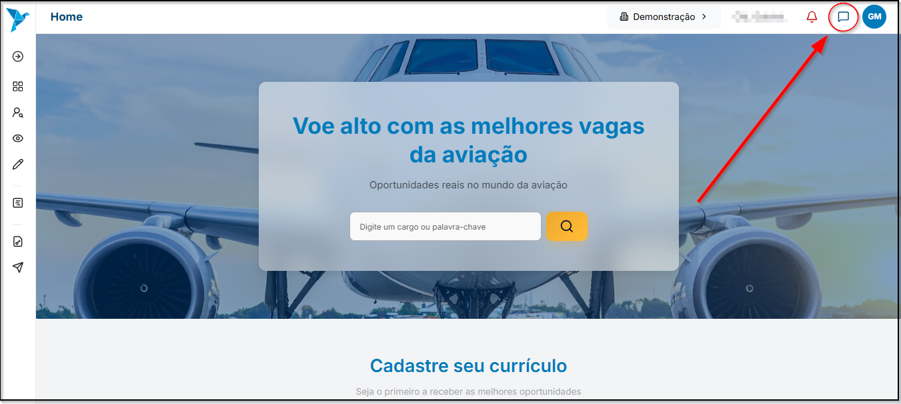
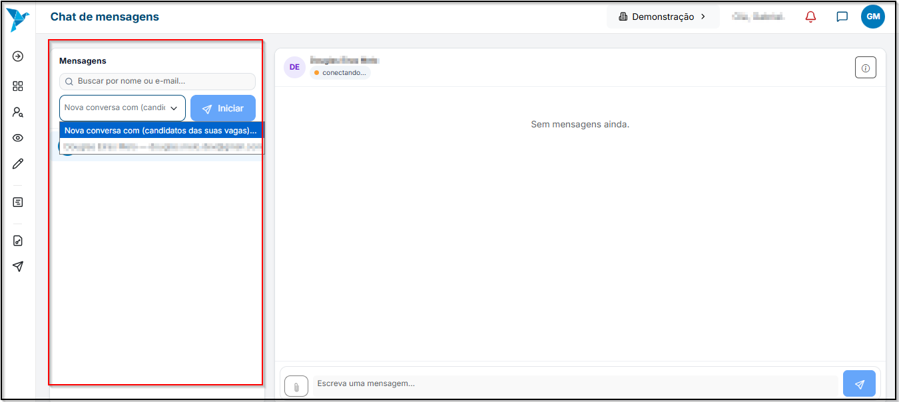

# <i data-lucide="message-square" class="icon-lg"></i> Chat

### <i data-lucide="target" class="icon-lg"></i> Objetivo

Ensinar como funciona o chat de mensagens na plataforma.

---

### <i data-lucide="square-check" class="icon-lg"></i> Pré-requisitos

- Ter uma **conta criada** no sistema (via cadastro ou convite de empresa).
- Ter confirmado o e-mail (caso exigido).
- Acesse a tela de [Chat](https://redeaviacao.com.br/chat).

---

### <i data-lucide="notebook-pen" class="icon-lg"></i> Passo a passo

1. O chat pode ser iniciado **apenas por um Recrutador**, com um candidato que tenha se **candidatado pelo menos uma vez** a uma vaga da empresa.  
   - O candidato **não pode iniciar** uma nova conversa, mas **pode responder normalmente** quando o recrutador enviar a primeira mensagem.

2. Para acessar o chat, clique no ícone de **balão de conversa** localizado no menu lateral esquerdo ou no canto superior direito da tela.
   

3. A tela inicial exibirá todas as conversas ativas, além da opção para **iniciar um novo chat**.  
   - Use o menu suspenso para **iniciar uma conversa com um novo candidato** (que já tenha vínculo com alguma vaga).  
   - Ou selecione uma conversa anterior para **retomar o contato com o mesmo candidato**.
   

4. É possível **``Buscar candidatos``** pelo **nome** ou **e-mail** na barra de busca do painel esquerdo.  
   
5. Assim que a conversa for iniciada:
    - O nome e o e-mail do candidato aparecem no topo do chat.  
    - O status de conexão será exibido **(ex.: “conectando...” ou “online”)**.  
    - A área principal mostrará o histórico de mensagens trocadas entre ambos.

6. Para enviar mensagens:
    - Digite o texto no campo **“Escreva uma mensagem...”** e clique no **ícone de envio**.  
    - O envio é instantâneo — a mensagem aparece imediatamente no histórico.

7. Para enviar anexos:
    - Clique no **ícone de clipe (📎)** ao lado do campo de mensagem.  
    - Selecione o arquivo desejado (formatos permitidos: PDF, JPG, PNG ou DOCX, até 10MB).  
    - Após o envio, o arquivo será exibido no chat para ambos os usuários.

8. Para visualizar o histórico:
    - Todas as mensagens são **armazenadas automaticamente**, permitindo consultar conversas anteriores a qualquer momento.  
    - Basta clicar no nome do candidato na lista à esquerda para reabrir o histórico completo.

9. Se desejar mudar de empresa (no caso de recrutadores vinculados a múltiplas organizações):
    - Use o menu superior e selecione a **empresa ativa** antes de iniciar ou continuar uma conversa.

---

### <i data-lucide="wrench" class="icon-lg"></i> Solução de problemas

??? "**Não consigo iniciar uma nova conversa**"
    - Verifique se o candidato **já se inscreveu** em pelo menos uma vaga da sua empresa (o chat só é habilitado para esses casos).
    - Atualize a página com **`CTRL + F5`** e tente novamente.
    - Confirme se você está logado com um **perfil de empresa/recrutador** ativo.

??? "**O chat não carrega ou fica em 'conectando...'**"
    - Verifique sua conexão com a internet.
    - Atualize a página e aguarde alguns segundos.
    - Tente acessar em uma **aba anônima** para eliminar problemas de cache.
    - Se persistir, limpe o cache do navegador e refaça o login.

??? "**Minhas mensagens não estão sendo enviadas**"
    - Certifique-se de que o candidato ainda está **vinculado à vaga**.
    - Verifique se o chat não está em modo **somente leitura** (alguns candidatos podem ter encerrado o processo).
    - Recarregue a página e tente reenviar a mensagem.

??? "**O nome ou e-mail do candidato não aparece na busca**"
    - O candidato precisa ter uma **inscrição ativa** em alguma vaga da empresa.
    - Confira se o e-mail foi digitado corretamente.
    - Caso tenha sido recentemente cadastrado, aguarde alguns minutos até que o sistema sincronize os dados.

??? "**Anexo não foi enviado**"
    - Verifique o formato do arquivo (permitidos: PDF, PNG, JPG, DOCX).
    - O tamanho máximo de cada anexo é de **10MB**.
    - Se falhar, tente reenviar após atualizar a página.

---

### <i data-lucide="lightbulb" class="icon-dica"></i> Dicas

- Utilize o chat para **comunicar-se diretamente com candidatos** durante o processo seletivo.  
- Seja **claro e profissional** nas mensagens — o chat é parte do histórico do processo.  
- Prefira mensagens curtas e objetivas, especialmente para **agendamento de entrevistas**.  
- O campo de busca permite localizar conversas antigas rapidamente por **nome ou e-mail**.  
- Use o ícone de **anexo 📎** para enviar documentos, feedbacks ou instruções.  
- Mantenha a conversa centralizada no chat do sistema para garantir **registro e rastreabilidade**.  
- Evite reabrir múltiplas abas do chat — isso pode causar instabilidade ou desconexões.  
- Caso esteja vinculado a várias empresas, **verifique a empresa ativa** no topo da tela antes de enviar mensagens.  
- Após finalizar uma conversa, mantenha o histórico salvo como referência para futuras interações.  
